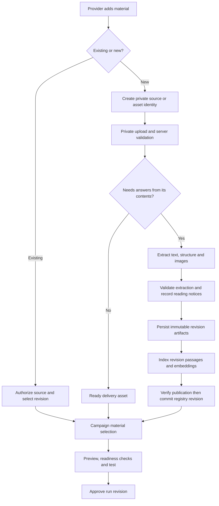
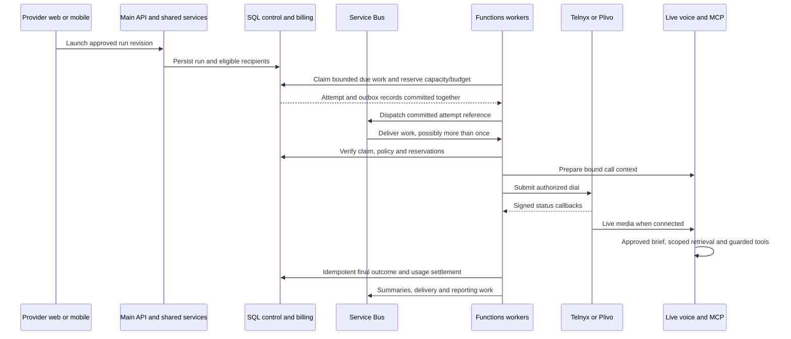

# Clinket outbound calls: end-to-end solution design

## Mandatory extension — one or several people without a campaign (2026-10-04)

**MUST READ `C:\Nik\Data\outbound-calls\QUICK-CALLS.md` IN FULL. THE OWNER REQUIRES ONE SHARED “CALL WITH AI” FLOW FOR ONE PERSON OR A SMALL SELECTED GROUP, NOW OR SCHEDULED, WITHOUT A VISIBLE OR HIDDEN CAMPAIGN. THIS IS PART OF THE APPROVED MOCKUP AND CURRENT SOLUTION, NOT A FUTURE OPTIONAL FEATURE. IMPLEMENT C25 AND Q01–Q16 WITH REAL PER-PERSON ELIGIBILITY, TIME REVIEW, IDEMPOTENCY, PARTIAL/UNCERTAIN-SAVE RECOVERY, RESULTS/HISTORY AND CANCELLATION. REUSE THE SAME ENGINE AND SHARED WEB/NATIVE COMPONENTS; DO NOT CREATE A GROUP MODEL OR ANOTHER ENGINE WITHOUT A JUSTIFIED CURRENT NEED.**

**PHASES 1–5 MUST RECORD THIS EXTENSION'S VERIFIED PROGRESS AND NEXT OWNER IN THEIR BUILD STATE AND NEXT COPY-PASTE HANDOFF WITHOUT A REMINDER. PHASE 6 AUDITS IT END TO END AND HAS NO SUCCESSOR. EXISTING FULL MOCKUP APPROVAL, COMPONENT REUSE, CREATIVE FREEDOM WITHOUT ROUTINE REAPPROVAL, STARTUP SIMPLICITY, SECURITY/COST/PERFORMANCE/DATA QUALITY AND NO-UI-STUB REQUIREMENTS APPLY. OPEN THE STUDIO'S CALLS & CALLBACKS → CALL WITH AI STATES; REUSE `Mockup/quick-calls.js` AND `quick-calls.css` AS DESIGN/INTERACTION REFERENCES THROUGH THE REAL APP COMPONENTS.**

## Mandatory two-way coverage, preview and reuse — final audit 4.1

**MUST READ AND FOLLOW `C:\Nik\Data\outbound-calls\Mockup\COVERAGE-AUDIT.md` IN FULL. CHECK BOTH DIRECTIONS: EVERY PROJECT REQUIREMENT MUST HAVE ITS INTERFACE/BEHAVIOR AND TEST; EVERY MOCKUP CAPABILITY MUST HAVE A PLAN REQUIREMENT, REAL CONTRACT, NAMED IMPLEMENTATION PHASE AND ACCEPTANCE TEST. THE MOCKUP IS FULLY OWNER-APPROVED, INCLUDING ITS REUSABLE COMPONENTS. NO FURTHER MOCKUP APPROVAL IS REQUIRED. DO NOT LOSE A MOCKUP FEATURE BECAUSE AN EARLIER PHASE DESCRIPTION WAS LESS DETAILED.**

**HOW TO VISUALIZE: OPEN `C:\Nik\Data\outbound-calls\Mockup\index.html` IN EDGE OR CHROME (POWERSHELL: `Start-Process 'C:\Nik\Data\outbound-calls\Mockup\index.html'`). NO INSTALL, BUILD OR SERVER IS NEEDED. INSPECT EVERY RELEVANT SCREEN/STATE, BOTH PRODUCT MENUS, ROLES, PHONE/TABLET/DESKTOP SIZES, WEB/NATIVE MODE AND SUPPORTED THEMES. USE OPEN FULL SCREEN AND ACTUALLY EXERCISE THE FLOWS; DO NOT REVIEW SCREENSHOTS ALONE.**

**HOW TO REUSE THE CODE: READ `C:\Nik\Data\outbound-calls\Mockup\COMPONENTS.md`. REUSE THE APPROVED TOKENS, ASSETS, CONTROL STRUCTURE, INTERACTION/RETURN PATTERNS AND RESPONSIVE LAYOUTS FROM `controls.js`, `controls.css`, `ui.js`, `styles.css`, `navigation.js`, `builder-tools.js`, `audience-ui.js`, `record-ui.js`, `campaign.js` AND `call-results.js` WHERE THEY FIT. START WITH THE VERIFIED REACT/NATIVE SHARED COMPONENTS MAPPED THERE. ADAPT THEM TO REAL STATE, LOCALIZATION, AUTHORIZATION AND APIs. NEVER COPY SYNTHETIC DATA, SIMULATED AI/CALLS/MESSAGES, GLOBAL DOM WIRING OR A TOAST AS A PRODUCTION INTEGRATION.**

**DATA QUALITY IS MANDATORY ALONGSIDE SECURITY, COST, PERFORMANCE AND FUNCTIONALITY: USE STABLE BUSINESS/RECORD/NUMBER IDENTITIES, E.164 NORMALIZATION, EXPLICIT TIME ZONES AND EVIDENCE PROVENANCE, FROZEN AUDIENCE/BRIEF VERSIONS, TYPED ANSWERS AND DISTINCT UNKNOWN/REFUSED/UNCONFIRMED STATES. COUNTS, CHARTS, HISTORY, FILTERED LISTS AND EXPORTS MUST AGREE. MUTATIONS MUST RENDER THE AUTHORITATIVE SAVED RESULT AND HANDLE CONCURRENCY/REPLAY. NEVER TREAT MISSING AS ZERO, NO, CONSENT OR SUCCESS. KEEP NECESSARY DATA WITHOUT SPECULATIVE FIELDS OR DUPLICATE SOURCES OF TRUTH.**

**APPLY CREATIVE JUDGMENT TO THE COMPLETE FUNCTIONALITY. DECIDE WHETHER EACH DETAIL MAKES SENSE IN THE REAL SYSTEM; REUSE, SIMPLIFY OR IMPROVE IT UNDER AUT-1 WITHOUT ROUTINE OWNER APPROVAL, INCLUDING JUSTIFIED NECESSARY SCHEMA/CONTAINER/ARCHITECTURE CHANGES. DO NOT OVERCOMPLICATE OR SILENTLY DROP A REQUIRED USER OUTCOME. RECORD THE RATIONALE AND UPDATE THE PLAN, COVERAGE REGISTER AND AFFECTED PROMPTS. ASK ONLY FOR A GENUINELY UNRESOLVED OR OWNER-DEPENDENT DECISION AFTER PRESENTING OPTIONS AND A RECOMMENDATION. EVERY EXPOSED CAPABILITY MUST WORK END TO END—NO UI STUBS.**


## Mandatory owner direction — final review and delegation, 2026-10-03

**MUST READ AND FOLLOW: `C:\Nik\Data\outbound-calls\IMPLEMENTATION-CHARTER.md` IN FULL, THEN `C:\Nik\Data\outbound-calls\PLAN.md` AND THIS ENTIRE PROMPT. THE CHARTER RECORDS THE OWNER'S LATEST PROJECT-SPECIFIC INSTRUCTIONS AND TAKES PRECEDENCE OVER EARLIER CONTRARY APPROVAL WORDING, INCLUDING COPIED STANDARDS, SKILLS AND MEMORIES.**

**THE ENTIRE MOCKUP IS FULLY OWNER-APPROVED AS A STARTING POINT AND REFERENCE. YOU HAVE CREATIVE FREEDOM TO IMPROVE UI, FUNCTIONALITY, NECESSARY FEATURES, SOLUTION DESIGN, ARCHITECTURE, CONTRACTS AND NECESSARY SCHEMA—INCLUDING SQL/COSMOS FIELDS, INDEXES AND CONTAINER CHOICE—WITHOUT ROUTINE OWNER APPROVAL OR A NEW MOCKUP. DO NOT OVERCOMPLICATE: USE THE SIMPLEST CORRECT SOLUTION THAT BALANCES COST, SECURITY, PERFORMANCE, FUNCTIONALITY AND LOW-FRICTION PROVIDER/CUSTOMER USE. DO NOT ADD DATA WITHOUT A CURRENT NEED; REUSE EXISTING ADMIN ALERTS WHERE SUFFICIENT AND ALLOW LEGITIMATE REPEAT FEEDBACK. JUSTIFY COSMOS PLACEMENT AND REAL RU/THROUGHPUT COST. RESEARCH CONSENT OPTIONS AND OTHER UNSTABLE/LEGAL FACTS WITH CURRENT OFFICIAL SOURCES; DO NOT ASSUME AUTOMATIC CONSENT OR A LIABILITY DISCLAIMER MAKES CALLS LAWFUL. ASK ONLY FOR A GENUINELY UNRESOLVED/TRICKY OR OWNER-DEPENDENT DECISION, AFTER COMPARING OPTIONS AND GIVING YOUR RECOMMENDATION.**

**NO UI STUBS OR INCOMPLETE WIRING: EVERY EXPOSED CAPABILITY MUST HAVE REAL WORKING INTEGRATION, PERSISTENCE WHERE NEEDED, AUTHORITATIVE RESULTS, VALIDATION AND FAILURE/PERMISSION/LIMIT HANDLING. MATCH THE ACTUAL SHARED DROPDOWNS, CHECKBOXES, TEXT FIELDS AND ALL CONTROL STATES. KEEP THE UI MODERN, FUTURISTIC, BRANDED, PLAIN-SPOKEN, EASY TO NAVIGATE, SPACE-EFFICIENT AND RESPONSIVE ACROSS DESKTOP, TABLET, PHONE WEB AND NATIVE APPS. USE NATIVE STRENGTHS WITH VISIBLE ALTERNATIVES; KEEP SUMMARIES AND HISTORY CLOSE.**

**FULL MOCKUP APPROVAL AND COMPONENT REUSE: THE ENTIRE MOCKUP IS FULLY OWNER-APPROVED—SCREENS, COMPONENT DESIGNS, STATES, NAVIGATION AND INTERACTIONS. NO FURTHER DESIGN APPROVAL IS REQUIRED. READ `C:\Nik\Data\outbound-calls\Mockup\COMPONENTS.md` IN FULL AND REUSE ITS COMPONENT SOURCE/PATTERNS, TOKENS AND EXISTING-APP COMPONENT MAP. DROPDOWNS, TEXT BOXES, CHECKBOXES AND ALL OTHER CONTROLS MUST FOLLOW THE APPROVED THEME, DESIGN, COLORS, LUFGA FONT AND BEHAVIOR. START WITH THE APP'S REAL SHARED COMPONENTS, REUSE OR IMPROVE THEM, AND BIND REAL FUNCTIONALITY. THE BROWSER MOCKUP'S SYNTHETIC STATE IS NOT A PRODUCTION INTEGRATION. YOU HAVE CREATIVE FREEDOM TO IMPROVE ANY UI OR COMPONENT FOR CLARITY, RESPONSIVENESS, EASY NAVIGATION AND A BETTER PROVIDER/CUSTOMER EXPERIENCE WITHOUT ASKING FOR APPROVAL OR CREATING ANOTHER MOCKUP.**

**ONE PHASE = ONE SESSION. AFTER A PHASE IS TRULY COMPLETE, WITHOUT WAITING FOR ANOTHER REQUEST OR REMINDER, GIVE THE OWNER A COPY-PASTE NEXT-PHASE PROMPT IN THE FINAL CHAT AND THE MATCHING HANDOFF FILE: EXACT NEXT PROMPT PATH, BASIC PURPOSE, VERIFIED BUILD-STATE CONTEXT, CHARTER/PLAN PATHS AND RELEVANT GOTCHAS. DO NOT START THE NEXT PHASE AUTOMATICALLY. THE LAST PHASE HAS NO NEXT-PHASE HANDOFF.**


## Complete functionality and campaign interaction requirements — owner direction, 2026-10-03

**IMPLEMENT ALL CAPABILITIES ASSIGNED TO THIS DEVELOPMENT PHASE WITH COMPLETE, WORKING INTEGRATION. DO NOT BUILD OR WIRE AN ACTION THAT HAS NO FUNCTIONALITY. NEVER SHIP OR MARK COMPLETE A STUB, PLACEHOLDER BUTTON, UNCONNECTED SCREEN, FAKE DATA PATH OR TOAST-ONLY SUCCESS. EVERY EXPOSED CONTROL MUST PERFORM ITS REAL OPERATION, PERSIST THE RESULT WHERE REQUIRED, UPDATE FROM THE AUTHORITATIVE RESPONSE, AND HANDLE VALIDATION, LOADING, FAILURE, PERMISSION AND LIMIT STATES. IF A DEPENDENCY IS MISSING, RESOLVE IT IN ITS RESPONSIBLE PHASE AND REPORT THE BLOCKER; DO NOT PRETEND THE FEATURE WORKS.** The isolated mockup's simulations are reference behavior only and must not be copied into integrated production code as functioning features. Phase 4 reconciles the approved reference to the backend and implements provider web/mobile in the same session; actual integration must be proved.

**FOLLOW THE OWNER'S CAMPAIGN INTERACTION REQUIREMENTS: SUPPORTING TASKS MUST RETURN TO THE SAME CAMPAIGN AND STEP WITH THE DRAFT INTACT; ACTUAL EXIT MUST OFFER KEEP EDITING, DISCARD CHANGES OR SAVE DRAFT & LEAVE. SAVED BRIEFS AND DRAFTING NEED CLEAR PURPOSE, REVIEW AND APPLY FLOWS. CONVERSATION SECTIONS MUST BE CLEAR AND RESPONSIVE. HANDOUTS MUST SUPPORT ADD, ACTUAL PREVIEW, APPROVAL, EDIT/COPY AND REMOVAL INSIDE THE BUILDER; A HANDOUT USED BY ANOTHER CAMPAIGN MUST NOT BE DELETED OR OVERWRITTEN. VOICES, LANGUAGES, SAMPLES AND SPEAKING-STYLE GUIDANCE MUST FOLLOW THE ACTUAL AI ASSISTANT SETTINGS. EXPLAIN PER-PERSON LOCAL CALLING HOURS, THEIR SOURCE AND UNKNOWN-ZONE HOLDS. ALL CHOICES MUST PERSIST AND APPEAR ACCURATELY IN REVIEW.** Apply each requirement within this phase's assigned responsibility; preserve the approved business rules and the latest charter’s decision boundaries. Do not guess production routes, contracts, schemas or settings.

**LATEST OWNER UX DIRECTION — INLINE FIRST, BOUNDED AUDIENCES, RELEVANT LOCAL WORDING (2026-10-03): KEEP SMALL CHOICES DIRECTLY IN THE PAGE WHEN THEY FIT; THE THREE ASSISTANT-INFORMATION CHECKBOXES BELONG IN CONVERSATION, WITHOUT AN EXTRA PICKER OR SAVE-SELECTION CLICK. ROOT DIALOGS CLOSE WITH ONE CLEAR ACCESSIBLE CLOSE CONTROL; RETAIN BACK FOR A REAL NESTED RETURN AND RETAIN UNSAVED-CHANGE PROTECTION. CALLING HOURS SHOW AUDIENCE COUNTS FIRST, THEN AN INLINE SEARCHABLE, FILTERED, PAGED LIST WITH A BOUNDED NUMBER OF ROWS—NEVER ALL 500 OR 5,000 PEOPLE AT ONCE. PEOPLE AND PERMISSION REVIEW MUST ALSO REMAIN BOUNDED AND PRESERVE SELECTIONS. PERSONALIZE EXPLANATORY COPY USING THE ACTUAL SELECTED CONTACTS’ DESTINATION COUNTRY AND TIME-ZONE BASIS, NOT UI LANGUAGE, A GUESSED COUNTRY FROM +1, OR ONLY THE PROVIDER’S COUNTRY. A DOMESTIC AUDIENCE MUST NOT SEE UNRELATED COUNTRY NAMES; MIXED AUDIENCES USE NEUTRAL PRIMARY COPY AND RELEVANT PER-DESTINATION DETAIL. UNKNOWN LOCATION STAYS HELD. KEEP SOURCE, HOLDS, COUNTS, ESTIMATES, SAVED DRAFT AND FINAL REVIEW CONSISTENT; KNOWN HOURS NEVER IMPLY CALLING PERMISSION.** Use real bounded queries and authoritative rules during implementation; mockup examples are not integrations. Preserve PLAN’s calling, consent and billing rules and the charter’s decision boundaries. These refinements are within the owner-approved UI freedom; no renewed UI approval or new mockup is needed.

Read `C:\Nik\Data\outbound-calls\Mockup\INTERACTION-REVIEW.md` fully. Its screen-by-screen review and operation/return-path acceptance requirements supplement the approved mockup and PLAN. Include the actual control-to-operation bindings and end-to-end success/failure/permission evidence in the phase handoff. UI improvement freedom and existing owner approval remain unchanged; no new mockup or renewed UI approval is required.


## Owner approval and UI creative freedom — 2026-10-02

**THE OWNER HAS APPROVED THE OUTBOUND AI CALLS MOCKUP AND THE REFINEMENTS MADE DURING THE FULL PROJECT REVIEW. `C:\Nik\Data\outbound-calls\Mockup\index.html` IS AN APPROVED STARTING POINT AND REFERENCE, NOT A RIGID PIXEL BLUEPRINT.** The owner said: “I'm approving all of it” and asked that implementing sessions be given creative freedom.

**EVERY SESSION IMPLEMENTING THESE PHASES MAY IMPROVE THIS FEATURE'S UI WITHOUT ASKING FOR ANOTHER OWNER APPROVAL AND WITHOUT CREATING ANOTHER MOCKUP FILE.** Exercise that freedom to make the interface **modern, futuristic and attractive; consistent with Clinket's real product branding, colours and Lufga font; easy to understand and navigate; clean and nontechnical in its language; complete against the requirements and every reachable state; fully responsive on desktop, mobile web and iPad/tablet; equally complete in the native mobile apps; and efficient in its use of space without dead areas, overcrowding or broken layouts. Harness native capabilities such as long press, swipe, bottom sheets, appropriate haptics, refresh, safe areas, accessibility and deep links, with visible alternatives to gestures. Critical information—including summaries, call history, recordings and next steps—must be directly accessible and must not require five or six pages of navigation.** Re-read the actual Business and AI Assistant dashboards and their web/native navigation before integrating. Improve navigation, hierarchy, density and interaction where useful while preserving requirements, rendering rules and web/mobile parity. Record the rationale and verification in the phase handoff; do not turn that record into another approval gate. A file-by-file UI plan is documentation, not another permission step: do not pause to approve UI layout, wording that preserves its meaning, density, navigation or interaction improvements.

**THIS IS AN EXPLICIT, PROJECT-SPECIFIC EXCEPTION TO THE RE-APPROVAL AND NEW-MOCKUP GATES FOR UI IMPROVEMENTS IN OUTBOUND AI CALLS, INCLUDING AN IMPROVED SCREEN OR STATE NEEDED TO MEET THE EXISTING REQUIREMENTS. DO NOT ASK THE OWNER AGAIN FOR THIS UI FREEDOM.** It supersedes contrary generic mockup rules, the earlier deferral and any narrower wording later in this prompt or its verbatim historical standards. The owner also explicitly chose the project-local `Mockup` folder; retain that location and its PLAN §0.4 register.

The original 2026-10-02 ruling approved the design. **The owner's later AUT-1 delegation broadens implementation freedom as set out in IMPLEMENTATION-CHARTER.md; earlier routine plan/schema reapproval waits are superseded.** No development phase is completed by a design approval. Legal eligibility, security, real integration, full localization and native-device verification remain implementation obligations. Do not invent a per-item approval or treat the delegation as permission for unrequested live deployment/calls.


**Current status — 2026-10-03:** Supporting design reference. PLAN records the approved solution and current scope; the entire refined mockup is approved. Five implementation phases and a sixth multidimensional audit are ready, with no production phase completed by this design review. IMPLEMENTATION-CHARTER.md governs delegated improvements and supersedes the original approval waits. Where this earlier recommendation differs from PLAN, use PLAN and record any justified change under AUT-1.

**Prepared:** 22 September 2026.

**Scope:** Individual outbound calls, requested callbacks and campaigns, with particular detail on knowledge, private campaign documents, reusable materials, delivery, authorization, versioning, billing and failure handling.

This document records the proposed product and architecture. Statements labelled **Current code** describe implementation inspected at preparation time and must be re-verified. Statements labelled **Recommendation**, and proposed data structures, describe work still to build. Necessary implementation and schema decisions are now delegated by the owner through AUT-1: justify current need, alternatives, costs and verification, without another routine approval or mockup. This does not authorize unrequested live deployment, destructive live-data changes or calls to arbitrary people.

**Reading guide:** [Document answer and examples](#1-the-answer-to-the-document-question) · [Permissions](#5-knowledge-permissions-independent-axes) · [Data model](#7-proposed-logical-data-contract) · [Backend isolation](#8-how-the-same-search-index-remains-private) · [Versioning](#10-content-revisions-and-document-changes) · [Delivery](#13-delivery-excerpts-originals-and-templates) · [Call execution](#17-dispatch-and-call-orchestration) · [Budgets](#20-billing-and-campaign-budgets) · [Edge cases](#24-edge-case-acceptance-matrix) · [Validation](#27-verification-and-release-criteria).

## 1. The answer to the document question

**Yes: when the assistant must discuss a document and answer questions about its contents, process it through the existing knowledge pipeline and put its searchable passages in Azure AI Search. Being in that index must not, by itself, make it available to inbound calls.**

**No: a file that the assistant only needs to deliver does not need to be indexed.** Store the file privately in Blob Storage, with a small authorized delivery record. The assistant can say what the provider explicitly instructed it to say about the file, but cannot claim to have read or explain contents it has not been given.

These are independent questions:

1. Does the assistant need to answer from the content?
2. May it send anything from this content, and in what form?
3. Which calls or team members may use it?

| Provider intention | Process as searchable knowledge? | Store original privately? | What the assistant receives |
|---|---|---|---|
| Explain a warranty and answer follow-up questions | Yes | Yes, for uploaded files | Approved call brief plus relevant, authorized passages |
| Send an existing brochure without discussing its contents | No | Yes | Approved description and an opaque asset reference |
| Explain the brochure and send the brochure | Yes | Yes; reference the same approved original where possible | Relevant passages plus separately authorized delivery capability |
| Send only the particular information discussed | Yes | Existing source storage remains | Exact authorized passage/image references for excerpt rendering |
| Fill a welcome-letter template with a confirmed name and appointment | No, for rendering | Yes, template and generated result | Typed fields and an approved template reference |
| Answer substantive questions about that letter or its terms | Index the relevant general terms, or supply an explicit approved brief | Yes | General terms plus this recipient's authorized structured facts |
| Give one short instruction, such as an approved appointment reminder | No | No uploaded file required | The instruction and authorized booking facts |
| Discuss one customer's private case information | Do not put it in the general business knowledge corpus | Only where required | Recipient-scoped facts after appropriate identity verification |

The model does not permanently learn the whole file when it is indexed. The pipeline extracts and structures content; retrieval gives the live model the relevant passages. A concise, approved call brief supplies the essential message proactively. Retrieval supports questions and details. Neither indexing nor a generated summary proves perfect understanding of every page.

**Recommended principle: store once where practical, process once per valid content revision, authorize every use.** Reusing processing must never merge two different permission identities.

## 2. The three provider scenarios

### 2.1 Select a document already in the knowledge base

The provider selects **Choose existing**, sees documents they may access, and chooses what this campaign may do: answer questions, send selected details, or send an explicitly approved original.

The campaign stores a reference to the selected document and its approved revision. It does not upload another copy, create another search index, or change the document's inbound settings.

The selector shows the source's existing availability. A library document already used by incoming calls must not receive a misleading “Only this campaign” badge merely because it was selected here. If the provider wants an independently edited/private variant, create an explicitly scoped copy. Keeping that copy private does not remove the original from its existing permitted uses.

If the document has not been approved for outbound use, an authorized manager can approve that use in the same flow. A campaign editor who lacks permission to change document access sees a blocked item and an actionable explanation. Reading an internal document is not sufficient authority to expose it to a customer.

**Example:** the existing installation guide can answer both inbound and outbound questions. A campaign selects it without changing either the guide or inbound behavior.

### 2.2 Upload a new document while creating a campaign

The default is **Only this campaign**. The server records this scope before processing starts. Inbound use is off. Ordinary Ask Clinket searches exclude it. It is visible to authorized people managing that campaign.

If **Use to answer questions** is enabled, reuse the document-reading, passage, image, embedding and indexing pipeline. If the file is **Send only**, skip those AI processing steps and use the private asset path.

**Example:** a September renewal offer is searchable for the renewal campaign, but an unrelated caller cannot learn about it through the inbound assistant.

### 2.3 Upload something reusable for future campaigns

The provider deliberately chooses **Save to business library**. The source becomes eligible for later campaign selection according to its outbound permissions. Inbound access remains an independent choice and stays off unless explicitly enabled.

**Example:** a campaign FAQ can be reused in several outbound campaigns while staying unavailable to all inbound calls.

Saving to the business library is not the same as enabling inbound answers. Adding an existing library item to a campaign is not the same as approving all library items for that campaign.

## 3. What exists in the code, and what must change

The current design already has useful foundations:

| Current code | Implication for outbound |
|---|---|
| `KnowledgeDocument` is a registry/work-order record in `KnowledgeBase`, partitioned by `businessId` | Reuse that registry for searchable sources; retain tenant partitioning |
| `ReceptionistAccess` is interpreted by `KnowledgeReceptionistRule` as `NotUsed`, `AnswersOnly` or `AnswersAndSends` | Preserve this as the inbound control; do not repurpose it as a single inbound-and-outbound toggle |
| `SearchAudience` and its role keys separately control team search | Campaign privacy must be enforced in addition to team audience |
| The repository currently returns an explicit visible-document allow-list for team search | Extend the rule with campaign scope; retain explicit allow-lists |
| Voice search loads permitted document IDs, filters retrieval and applies result checks | Extend this pattern with server-bound outbound run and revision context |
| Search resolves the business's private search route through `ISearchTopology` | Use that route; never send campaign content to the public marketplace search plane |
| Normal upload management can default receptionist access to `AnswersAndSends` when the receptionist is available | A campaign upload must have a distinct server-enforced default; merely hiding the inbound toggle is unsafe |
| Duplicate uploaded content is detected by business and content hash, and can merge into another document | Restrict deduplication by permission scope; a private upload must not mutate an inbound library record |
| Ingestion can queue service-draft analytics | Campaign-only sources must not automatically create service drafts or marketplace content |
| Existing card IDs are based on business, document and chunk ordinal; `CardsRewriting` protects the in-place rewrite window | Reliable campaign pinning needs revision-aware publication, not only a hash on the campaign |
| `send_material_info` sends selected excerpts/images through the existing material pipeline | Sending a whole original or filling a template is additional functionality, not an existing capability of that tool |
| The delivery worker rechecks current document permissions | Keep this final check and make it aware of direction, run, revision, asset and recipient |

Some access interpretation comments in large files describe older behavior. The actual rule implementations and their tests govern the current behavior. For example, a processing document can currently remain answerable from its previous committed cards while `CardsRewriting` is false and a prior passage count exists. This design preserves that availability intent while replacing in-place content publication with explicit revision publication.

The current filter helpers also have a large-allow-list fallback to application post-filtering. The proposed outbound path must not silently fall back to a broad business search when its permitted-source list exceeds a bound. It must split into bounded authorized queries or reject the configuration before launch.

## 4. Product model: one calling engine

Use one engine for:

- **Individual calls:** one shared form from Contacts, profile, dashboard or Calls for one person or a bounded small selection. A booking entry stays one fixed customer. Each accepted person gets an independent request; no campaign is created.
- **Campaign:** a brief and controlled recipient set.
- **Requested callback:** a recipient's agreed follow-up time, linked to the previous interaction.

Individual requests use the planned `RecipientCall` kind `OneOff` with a null campaign relationship, through the common engine. The form may submit one or a small group with a shared immutable brief and schedule. Each request has its own eligibility, idempotency, result/history and cancellation. No private campaign knowledge store or hidden campaign is introduced; QUICK-CALLS.md governs partial/uncertain submission recovery and source privacy.

A reusable campaign template contains instructions, question definitions and references to reusable approved materials. It contains no live recipients, previous answers, recipient-specific documents or standing permission to contact somebody.

A run revision fixes the goal, greeting, essential statements, questions, tools, materials, permitted delivery channels, model tier, schedule and limits. Editing a running campaign creates a new revision for future attempts. It cannot mutate a conversation already in progress.

## 5. Knowledge permissions: independent axes

### 5.1 Source scope

Use two source scopes initially:

- **Business library:** a reusable business source.
- **Campaign private:** owned by one run and accessible only in that run's authorized context.

These are proposed concepts, not existing enum values. Scope is established by the backend. An ordinary update request cannot turn a private source into a library source by changing an ID or omitting a field.

Private-to-library promotion is an explicit operation. It shows the resulting team, inbound and outbound permissions, preserves the content revision, and records who approved the expansion. Copying a campaign with private sources creates independently scoped source identities for the destination campaign, or asks the authorized owner to promote them to the library. It never silently shares the source's original private scope.

### 5.2 Who may use a source

| Surface | Permission decision |
|---|---|
| Ordinary Ask Clinket | Business-library scope, readable content, and the member's existing team-audience rule |
| Campaign document preview or campaign-scoped assistant | Permission to access that run and source, plus the relevant member/branch restrictions |
| Inbound voice | Business-library scope plus the current inbound receptionist permission |
| Outbound voice | Exact run selection plus the current outbound source permission, approved revision and recipient eligibility |
| Original-file delivery | Separate approval to send the whole original plus the selected run and recipient |
| Excerpt/image delivery | Permission to send those exact details/images plus the selected run and recipient |
| Marketplace/public page/service extraction | No automatic path from a campaign-private source |

Even an owner using ordinary Ask Clinket should not accidentally mix campaign-private content into unrelated business answers. Owners can deliberately open the campaign and inspect its documents there. Human administration access and automated disclosure access are different capabilities.

### 5.3 What may be done with the source

Preserve the existing inbound permission values. Introduce an independent outbound answer/excerpt policy with the same understandable choices: not used, answers only, answers and selected details.

Whole-original delivery is a separate approval. **Answers and selected details must never imply permission to send the entire file.** An internal guide might contain acceptable customer answers and confidential pages in the same file.

For a delivery-only original or template, its asset record carries delivery eligibility; it does not need a dummy searchable knowledge record. If an existing knowledge file supplies the original, the asset references its immutable source revision rather than uploading identical bytes again.

The campaign selection can narrow source permissions. It cannot widen them. The effective permission is the intersection of current source permission and the run's approved selection.

### 5.4 Truth table

| Source | Inbound | Campaign A | Campaign B | Ordinary Ask Clinket |
|---|---|---|---|---|
| Library guide, inbound on, outbound approved, selected only in A | Allowed | Allowed | Not selected | Existing team audience |
| Library FAQ, inbound off, outbound approved, selected in A and B | Denied | Allowed | Allowed | Existing team audience |
| A-private searchable upload | Denied | Allowed | Denied | Excluded |
| A-private send-only brochure | Denied | Delivery only | Denied | Excluded |
| Library source, outbound off, inbound on | Allowed | Denied until explicitly approved | Denied | Existing team audience |
| Source revoked or being deleted | Denied | Denied | Denied | No automated content access |
| Source readable only by managers, outbound not approved | According to separate inbound setting | Editor cannot approve disclosure | Same | Managers only |
| Recipient-specific generated document in A | Denied | Its bound recipient only | Denied | Excluded from general search |

Answering a telephone call is not identity verification. Even within the correct campaign, confidential information waits for the required verification.

## 6. Storage and ownership

| Information | Recommended store | Reason |
|---|---|---|
| Knowledge source metadata, scope, current permission and published revision | Existing `KnowledgeBase` Cosmos container, `/businessId` | Reuses the current registry and tenant-scoped read paths |
| Searchable passages, embeddings and minimal retrieval metadata | Existing private knowledge index selected by the business's search topology | Reuses retrieval; no per-campaign index |
| Uploaded originals, extraction artifacts, images and reusable processing cache | Existing private `provider-knowledge` Blob container | Bulk bytes belong in object storage |
| Delivery-only asset metadata and campaign/source bindings | SQL outbound control records | Relational run references, revisions, recipient restrictions and delivery state |
| Delivery-only originals, templates, generated files and exports | Private Blob Storage | No need for embeddings or large Cosmos documents |
| Campaigns, recipients, attempts, actions, due work, consent and budget reservations | SQL control plane | Indexed due-work claims and atomic scheduling/accounting decisions |
| Existing live call context and short-lived transcript buffering | Current voice Cosmos paths | Reuses live voice integration; do not introduce per-audio-frame database writes |
| Long transcripts and recordings | Existing private voice Blob containers | Reuses the current artifact pattern |
| Structured answers and outcomes | Bounded SQL recipient/attempt fields | Queryable campaign reporting without storing every utterance in a hot record |
| Large analytics/export history | Blob/Parquet pipeline | Avoid scanning operational stores for every dashboard chart |
| Work messages | Service Bus | Durable dispatch, not the source of truth for consent, budgets or scheduling |

SQL for outbound scheduling/control is a deliberate proposed exception to the current general Cosmos operational-data convention. It is justified by the need to claim due work together with financial reservations and by avoiding a global Cosmos scheduler scan. Validate and record the necessary architecture/schema decision under AUT-1 without another routine approval. Search and Blob are never consent or billing authorities.

No new Cosmos container is required by this recommendation. Exact new SQL tables, columns and indexes, Cosmos fields and Search fields must be presented in the required schema inventory when their consuming implementation phase is ready.

## 7. Proposed logical data contract

Names below describe the proposed design. They are not claims that these classes, tables, fields or APIs already exist.

### 7.1 Knowledge registry additions

Keep current document identity, source information, lifecycle, inbound access, team audience and image metadata. Add the minimum facts needed for:

| Proposed fact | Shape | Reader/writer responsibility |
|---|---|---|
| Scope | Fixed enum: library or campaign private | Upload/promotion writes; every retrieval, preview, list and delivery authorization reads |
| Owning run | Nullable run identifier; mandatory for campaign-private scope | Campaign upload writes; run-scoped authorization reads |
| Outbound use | Fixed enum for answers/excerpts, default deny | Authorized source-management operation writes; outbound retrieval/delivery reads |
| Published revision | Opaque immutable revision identifier | Ingestion publishes; campaign validation, retrieval and delivery read |

Do not add separate Boolean fields for every campaign, customer or channel. Do not put an ever-growing campaign-ID collection on a knowledge document. Do not store a fixed permission vocabulary in a lookup table.

Scope and owner are inseparable: a private source with no valid owning run is unusable, even if other permissions appear permissive. An unknown stored scope or access value denies use. All new upload paths write explicit values. No production backfill is required for the currently planned fresh environment, but a pre-existing malformed or old row must still fail safely.

### 7.2 Run/material relationship

The proposed run-material association records business, run revision, source or asset identity, approved content revision, permitted use, required/optional status and any recipient applicability rule. It is one row per selected material because a run has many materials and a library document can be selected by many runs.

The association never copies current source authorization as a permanent grant. A live permission reduction overrides it. Display labels and a manifest hash can be retained for audit, but they do not authorize access.

### 7.3 Delivery assets

A proposed delivery asset records business, immutable revision, original/template kind, private blob reference, measured type/size/hash, readiness/security state, allowed recipient scope and optional link to its knowledge-source revision. A template additionally stores a bounded typed merge-field definition.

A generated recipient file belongs to a durable delivery action: run, recipient, action ID, source/template revision, input snapshot hash, output blob reference and delivery state. It does not become a new searchable business knowledge document.

### 7.4 Calling and financial records

| Logical record | Necessary facts |
|---|---|
| Run and immutable run revision | Business, type, owner/branch scope, goal, schedule, policy version, model tier, lifecycle and limits |
| Recipient | Run, contact reference, normalized destination, timezone evidence, applicability, next due time, progress and bounded typed answers |
| Attempt | Recipient, ordinal, frozen run revision, carrier request/call identifiers, reservation, timestamps and observed outcome |
| Action | Stable logical operation ID, recipient, input hash, pending/accepted/completed/failed/unknown state and receipt |
| Contact policy and consent events | Normalized phone, business, channel, purpose, latest grant/revocation, event order and evidence reference |
| Phone guard | Scoped suppression/active-call coordination without exposing one business's data to another |
| Authorized route | Country, carrier, permitted purpose, owned/verified caller identity and capability/approval status |
| Credit balance and reservation | Existing billing grants/ledger integration, eligible model tier, integer seconds, expiry, held/settled/released state |
| Transactional outbox and webhook receipts | Durable dispatch/event identity, retry state and reconciliation correlation |

Use tenant-qualified relationships and uniqueness constraints, including one active logical recipient per run/normalized phone, one attempt ordinal, one logical action and one final reservation settlement. A shared household number can represent different people; deduplicating the destination does not establish their identity.

Store time instants in UTC, calling windows with named timezones, financial amounts in integer minor units and allowance usage in integer seconds. Questionnaire definitions and answers may use bounded JSON where their fields are genuinely campaign-specific; index only fields with actual query requirements.

## 8. How the same search index remains private

An index is a storage/retrieval mechanism. The application decides which documents a caller can retrieve. Microsoft's security-filter pattern explicitly depends on applying the filter to every query; a stored permission-looking string does not itself authenticate anyone. [Microsoft: security filters](https://learn.microsoft.com/en-us/azure/search/search-security-trimming-for-azure-search)

### 8.1 Server-bound context

Every outbound session binds business, run, run revision, attempt, recipient, verified-identity state, selected material manifest and permitted tools. The model cannot supply or replace these values. A document ID in speech, a tool argument or a prompt is not authorization.

The existing inbound entry path keeps an inbound context. It cannot become an outbound context because the caller mentions a campaign name. Direction comes from authenticated call creation/binding, not the incoming HTTP body or language-model output.

### 8.2 Retrieval algorithm

1. Authenticate the live call binding and resolve the business's current private search route.
2. Load the run's bounded approved material manifest and current source policies.
3. Intersect selected sources with permitted use, content readiness, approved revisions, source scope, time validity and recipient applicability.
4. If the set is empty, return an honest no-authorized-source result. Do not execute an unrestricted search.
5. Apply the business and exact authorized document-revision filter to every keyword/vector leg and companion lookup.
6. Check every returned item against the same business, document and revision set before returning content to the model.
7. Check fresh permission state at the retrieval response boundary. On revocation or inability to establish authorization, discard the affected result.
8. Return bounded passages with provenance. Return send references only for independently permitted delivery uses.

Conceptual filter, using a **proposed** filterable document-revision key:

```text
businessId equals the server-bound business
AND documentRevisionKey is in the server-built authorized set
AND any additional relevance filters
```

The document-revision key binds the document to its revision in a single filterable value. Two unrelated lists of document IDs and revision IDs could accidentally admit an unapproved combination. Do not store thousands of recipient IDs or campaign grants on every search passage.

Use the index's supported vector behavior and benchmark it; the security requirement is the authorized query filter on every leg plus verification before disclosure. Do not blindly copy a vector-filter mode from a different index topology. Microsoft documents the recall/performance trade-offs of filtering modes. [Microsoft: vector filters](https://learn.microsoft.com/en-us/azure/search/vector-search-filters)

### 8.3 Inbound algorithm

Inbound permitted sources are only readable **business-library** revisions for which `KnowledgeReceptionistRule` permits answering. Private scope independently excludes the source even if its inbound permission was accidentally set permissively. The inbound allow-list never includes campaign-private documents.

This is source isolation, not a promise that inbound can never say the same fact. If a price or sentence also appears in an independently authorized library document or public business profile, inbound may know it from that source. To make a fact confidential, its other published/authorized occurrences must also be addressed. Access tests therefore use unique private facts and verify provenance.

The same restriction applies to images, overviews, document titles, direct lookups, language-discovery metadata, availability hints, previews and delivery. A helper that reveals a private document's title or uses its summary in the initial prompt is also a disclosure path.

### 8.4 All the paths that must honor the rule

| Path | Required boundary |
|---|---|
| Normal knowledge search | Bound business and authorized revisions |
| Multilingual search legs | Identical authorization set on every leg |
| Broadened service relevance retry | May remove a relevance preference; may never remove source authorization |
| Overview companions and adjacent chunks | Same source revision and permitted set |
| Exact reference/page lookup | Independently authorize; no assumption that an earlier search authorized it forever |
| Image captions, image downloads and thumbnails | Source permission, image permission and correct revision |
| Initial call brief and source summaries | Only facts approved for this run/recipient; record their provenance |
| Team search, citations and original-view links | Team authorization plus source scope |
| Retrieval caches | Tenant/context/revision-aware key; current authorization reapplied on every use |
| Sending and delayed retries | Fresh run/source/recipient/channel checks immediately before external submission |
| Index rebuilds and repair jobs | Preserve scope/revision metadata; never move private content to the public plane |
| Catalog/service extraction | Private sources excluded unless explicitly promoted and separately approved |
| Exports and campaign reports | Business, member and branch/run permissions; no general public URL |

### 8.5 Cross-host consistency and permission revocation

**Current code/infrastructure:** `azureautomation/database.json` configures Cosmos with Session consistency. A different API, Functions or MCP process has its own client session. Simply saying “read the row again” does not prove that process observed the latest permission write. Microsoft documents flowing the partition's session token between application nodes for this purpose. [Microsoft: managing Cosmos consistency and session tokens](https://learn.microsoft.com/en-us/azure/cosmos-db/how-to-manage-consistency)

**Recommendation:** use a small, per-business knowledge-policy barrier on the existing SQL business record: a monotonic generation, open/closed mutation state and the last committed session token for that business's knowledge partition. These are proposed one-to-one fields, not a new table. The barrier carries synchronization state, not a second copy of the source permission rules. Cosmos remains the source-policy authority.

Permission-changing operations, source deletion, scope promotion and publication of a new effective revision follow this sequence:

1. Claim and close the business's knowledge-policy barrier in SQL with a durable operation identity. Serialize these short metadata mutations; do not hold the barrier closed during extraction or embedding.
2. Apply the intended Cosmos mutation with ETag protection and capture its response session token. Concurrent metadata edits must be preserved.
3. Commit the new generation/token in SQL and reopen the barrier. Report the operation complete only when this succeeds. A worker crash leaves the barrier closed for reconciliation; a lease timeout never reopens it by itself.
4. Signal affected active sessions and pending actions to invalidate old authorization and derived briefs.

A disclosure operation reads the open barrier, supplies its partition token to its Cosmos authorization reads, and verifies that the barrier is still open at the same generation immediately before releasing results or authorizing a send. A changed generation triggers a bounded re-evaluation. SQL or policy-read failure denies knowledge use. Source-free approved business greetings can still work; the assistant must not falsely say that the business has no documents.

All permission-changing writers must participate, including image-sendability changes, promotion, deletion, support tools and import paths. The operation journal uses the outbound/control outbox infrastructure; it must preserve the captured token or repeat an idempotent conditional Cosmos operation to establish one during recovery. Do not persist a token for a different container or partition. Do not depend on a preview consistency feature or change the entire Cosmos account to Strong as part of this design.

Batch these checks per retrieval/send operation, not per passage or audio frame. The extra SQL point reads are a deliberate cost for a defined cross-host authorization boundary and must be measured with the voice workload. Immutable content may be cached; an old “allowed” result may not bypass the barrier.

The precise guarantee is **no newly authorized operation after the barrier closes**, until current policy has been established. An operation already authorized, audio already streaming or a message already submitted can be in flight. Cancellation tries to stop it; it cannot unsay words or recall a delivered attachment. Gate each new answer/action, and terminate or clear active context on revocation. The UI must distinguish revocation applied from already-delivered material.

## 9. Ingestion and publication flow



The scope exists before any worker can process the upload. Upload confirmation revalidates business/run ownership, actual bytes, content type, size and the server-issued path. The filename is a display label, not an identity or permission.

Use the existing supported document formats and parser limits. The product must not promise that literally every file format can be read. A format that is safe to deliver but not supported for extraction can remain send-only with a clear status. Password-protected, corrupt, truncated or unreadable files do not become usable knowledge by default.

Typed FAQs follow the same scope, answer/send policy, revision and campaign-binding rules as uploaded knowledge. A FAQ has no original file to send; it can contribute approved answers or rendered excerpts. Creating it inside a campaign must not accidentally use the ordinary library defaults.

Malware and active-content checks apply to delivery originals/templates as well as searchable files. Do not follow arbitrary links, execute macros or allow a document's embedded instructions to change tools, tenant identity, contact policy or financial limits. Extracted content is evidence, not application instructions.

For an upload with both uses, track answer readiness and delivery readiness independently. Successful reading does not mean the original is approved for sending; a sendable file does not mean it was successfully read.

Partial extraction stays visible to the provider. Required unreadable material blocks launch. Nonessential material can be removed or explicitly accepted with its limitations after testing. Do not let a campaign claim a mandatory message is covered merely because its source says Ready.

## 10. Content revisions and document changes

### 10.1 Why a content hash alone is insufficient

Current search keys can be overwritten when a document is reprocessed. A campaign remembering yesterday's hash cannot retrieve yesterday's passages if those passages were overwritten. A new parser or extraction model can also change the effective reading of identical file bytes.

**Recommendation:** publish immutable effective-content revisions. The revision identifies the source bytes and accepted extraction/presentation result, with processing provenance. Changed content, accepted extraction or material facts produce a new revision. A permission-only edit does not require re-embedding and is evaluated live.

### 10.2 Publication sequence

1. Keep the currently published revision usable while the replacement is prepared.
2. Write immutable source/artifact references for the candidate revision.
3. Write search cards whose keys include the revision identity.
4. Validate each indexing result and verify the expected revision content is retrievable. A successful HTTP transport is not proof that every document in a batch succeeded. [Microsoft: index loading and partial results](https://learn.microsoft.com/en-us/azure/search/search-how-to-load-search-index)
5. Publish the new revision with a conditional registry update. Preserve concurrent permission edits and honor deletion/tombstones.
6. Inbound and ordinary team retrieval use the newly published revision after their current authorization check.
7. Future campaign attempts detect that the selected revision has changed and wait for material review. Do not silently adopt the replacement.

There is no distributed transaction between Cosmos and AI Search. Correctness comes from writing inert candidate revisions first and authorizing only a committed revision. Failed candidate publication leaves the prior committed revision intact. Orphan candidates are cleaned up idempotently.

Budget temporary storage/index headroom for candidate and still-in-use revisions. Existing passage limits must not be applied as though only one physical revision exists during publication. Bound the number/bytes of retained revisions, account for both committed and temporary usage, and delay a replacement when safe headroom is unavailable. Never delete the current or in-use revision to make an unsafe replacement fit.

### 10.3 Active conversations and pending sends

An ordinary content update does not splice new facts into an ongoing call. An already authorized call may finish on its pinned revision during its bounded attempt lifetime, provided the source has not been revoked, deleted or expired. Future attempts require review of the replacement.

Reserve the lifetime of the exact revision before the call starts. A revision cleanup worker must coordinate with these bounded reservations and use a deletion state that prevents new reservations. An age-only Blob lifecycle rule must not delete an in-use revision. Reuse the same revision among calls; do not clone its index cards per recipient.

Post-call delivery has its own bounded authorization lifetime. Recommendation: queued material delivery expires after 24 hours unless the source, consent or purpose expires sooner. If the source changes before submission, hold the send for review rather than silently send a different revision. Do not hold old searchable revisions indefinitely just because a campaign is paused.

Revocation is different from ordinary replacement: stop new retrievals and sends immediately after the authoritative change, invalidate dependent briefs, and signal active sessions. A model already given the text cannot be made to unsee it. For a revoked source, stop the affected conversation or restart with a cleared context and a safe handoff message; an extra prompt saying “forget it” is not an adequate control. Information already spoken or files already received cannot be recalled.

### 10.4 What the provider sees

- Processing a replacement: the old approved version still works.
- Replacement failed: the old version remains; show the failure and retry option.
- New version ready: show affected campaigns and “Review updated material.”
- Required source revoked/deleted/expired: pause affected future calls.
- Optional source removed: exclude it and show the narrower capability; never pretend it is still available.
- Historical call: identify the actual run/source revisions used, subject to artifact retention.

## 11. Deduplication without permission side effects

The existing business/content-hash duplicate merge is appropriate to review before reuse. Even its conservative permission merge could turn an existing inbound document off if a private campaign copy were merged into it. It could also change its name, links or team-audience metadata.

Recommended rules:

1. Choosing an existing document creates a run reference; no duplicate ingest.
2. Identical upload within the same private run/scope may reuse the same source identity after explicit metadata rules are applied.
3. Identical bytes across different private runs or between private and library scope never cause an automatic identity/permission merge.
4. Reuse only permission-neutral extraction/embedding artifacts when the business, bytes, parser/model/prompt versions and grounding inputs match. Bind resulting cards and manifests to the receiving source identity.
5. Do not reuse a campaign-specific summary, recipient answer, source title or instruction as if it were neutral extracted content.
6. No cross-business content deduplication or existence disclosure in this first design.
7. Duplicate-file detection must return the canonical surviving identity to the campaign binding; do not leave it pointing at a removed registry row.

Independent source identities can cost additional small registry/index records. That cost is justified where their lifecycle or permissions differ. Start with correct isolation; optimize shared physical bytes only when reference ownership and deletion have been proven.

## 12. How the assistant prepares and conducts the call

### 12.1 Approved brief

The campaign builder captures goal, purpose, opening, mandatory statements, questions, completion criteria, fallback behavior, permitted actions, target duration and maximum duration. An optional AI draft must cite its selected source revisions and be reviewed before launch.

Put essential statements into the compact approved brief. Do not require the model to rediscover the campaign's main offer with an unpredictable search. Use retrieval for supporting details and recipient questions. A hand-authored brief is still bound to the campaign and cannot override source restrictions or tool policy.

Check contradictions before launch: two prices, expired offers, different eligibility rules, conflicting opening instructions, or instructions to use an unapproved document. The provider must resolve substantive conflicts; the model does not silently choose the most persuasive version.

The brief includes only the business facts and recipient facts needed for this call. Do not embed an entire library or a 200-page PDF into each session. Customer answers and previous private conversations are never mixed into the general campaign brief.

### 12.2 Conversation policy

The assistant identifies the business and itself as its AI assistant, states the purpose briefly, checks whether it is a suitable time, verifies identity when needed, completes the objective and closes with confirmed outcomes. It adapts wording and language without changing the approved facts or commercial commitments.

An interruption, question, request for a person, opt-out or “not now” takes priority over a script. A recipient may refuse individual questions. Store refusal or uncertainty explicitly, not as a guessed answer. Unsupported questions lead to a truthful limitation and an authorized follow-up option.

Administrative tasks remain the initial boundary for medical, legal, insurance and financial businesses. Document access does not authorize diagnosis, professional advice, underwriting or financial decisions.

### 12.3 Tools and actions

Tools use server-bound business/run/recipient context. Booking, sending, updating information, recording an opt-out and scheduling a callback each have a durable action ID and explicit completion result. The model cannot announce success until the backend confirms it.

Retries across calls reuse the logical action identity where the intended action is the same. If an external action might have succeeded but its acknowledgement was lost, reconcile it before trying again. A conversation retry is not permission to create another booking or send another document.

## 13. Delivery: excerpts, originals and templates

| Delivery type | Behavior | Mandatory safeguards |
|---|---|---|
| Selected details | Extend the current excerpt/image pipeline | Exact authorized references, revision and image checks; no fabricated source text |
| Whole original | Deliver an approved immutable original | Separate original-send approval, measured type/size, recipient/channel binding |
| Template-generated document | Deterministic merge into an approved template | Typed allow-listed fields, verified input, preview, output validation and action idempotency |

Start templating with supported DOCX merge fields and fillable PDF forms. A PDF page image is not automatically a fillable PDF. Arbitrary PowerPoint/Excel/document rewriting is not implied by knowledge ingestion support. A new format requires a renderer and validation contract.

Template values come from authorized records or explicitly captured/confirmed answers. Missing required values block generation. Escape user content, preserve locale/date/currency formatting, and do not execute macros or arbitrary template expressions. No AI invention of names, signatures, dates, prices or account details. Binding a recipient must survive retries, concurrent generation and preview caching.

An uploaded original may contain hidden comments, tracked changes, spreadsheet sheets, speaker notes or file metadata that were not spoken or indexed. Original delivery needs whole-file approval and a preview. Offer a sanitized approved export where appropriate, and identify it as a separate revision. The fact that extraction omitted a hidden field does not remove it from the original file.

### 13.1 Delivery sequence

1. Confirm which approved item the customer wants and the permitted destination/channel.
2. Verify identity for confidential recipient-bound material. Reading back an email confirms transcription, not ownership of the mailbox.
3. Check channel consent, suppression, current source permission, run binding, asset readiness/expiry, destination health and remaining spend allowance.
4. Persist a durable action with its exact revision and input hash before rendering or sending.
5. Render if necessary, store privately, then recheck authorization at external submission.
6. Record carrier acceptance separately from delivery confirmation or failure.
7. Retry only according to that action's delivery policy. An ambiguous submission enters reconciliation, not an immediate duplicate send.

Use opaque application links for customer downloads. Redeeming a link checks expiry, revocation and recipient requirements; it may issue a short-lived read URL after authorization. A signed storage URL is a bearer capability until it expires; the UI must not promise instantaneous recall of such a URL. Sensitive content requires authenticated redemption or another approved verification mechanism.

### 13.2 Channels

Email and WhatsApp are the principal document channels. Reuse the platform's existing dispatch and delivery-feedback mechanisms where their contracts fit.

A telephone conversation does not open a WhatsApp customer-service messaging window. Check WhatsApp opt-in and the applicable approved-template/window rules when sending. Channel policies must be applied to the actual recipient and business context. [WhatsApp Business Messaging Policy](https://whatsappbusiness.com/policy/)

SMS remains short text or an approved secure link when the number/channel supports it and consent permits. It is a separate proposed delivery capability; the current `send_material_info` tool explicitly refuses SMS.

A failed email does not automatically cause another telephone call or a WhatsApp message. Use only preauthorized fallback channels. Let the provider see accepted, delivered, failed, expired and awaiting-review separately.

## 14. Recipient-specific information

A common campaign document and a customer's personal document have different scopes. Never index all patients' letters, account balances or case files as general campaign knowledge and rely on the model to choose the right name.

Use recipient-scoped structured context and recipient-bound delivery actions. Prefer current authorized booking/account facts from tools over a stale uploaded spreadsheet. Imported recipient fields require validation, provenance and bounded retention; spreadsheet cells are untrusted data, not prompt instructions.

For very large private case documents that truly require retrieval, the safe extension is a dedicated recipient-bound retrieval contract with recipient scope enforced in every query and direct read. That is not automatically enabled by this first design. Until implemented and validated, reject that use or route it to a human; do not fall back to the shared business corpus.

## 15. Returning inbound calls

An outbound recipient may call the business back. That remains an inbound call governed by existing inbound modes. Caller ID and a recent campaign match can suggest context, but do not grant access to private campaign content.

Recommended initial behavior: recognize the possibility of a recent outreach, verify the caller where needed, explain only an approved neutral reason, and offer an authorized requested callback or human handoff. If private campaign answers are needed on that incoming call, a separate explicit “allow verified return calls for this campaign” capability must be designed and approved. Its default is off.

This makes “inbound cannot use this document” a clear promise. A return-call convenience must not secretly bypass it. An inbound conversation that independently completes the objective cancels the remaining outbound attempts through the shared recipient state.

## 16. Campaign creation and readiness

Use a short guided flow: **Goal → Contacts → Materials → Schedule and limits → Test and launch**. Keep advanced policy details progressively disclosed.

The Materials step offers **Choose existing**, **Upload** and **Write a short answer/instruction**. Each item shows its role, privacy, processing readiness, approved revision and whether it is essential. Use plain labels such as “Only this campaign,” “Incoming calls: off,” “Answer questions,” and “Send original.” Do not ask providers to understand indexes or embeddings.

Default an uploaded campaign knowledge file to answer-only, campaign-private and inbound-off. Sending requires its own deliberate choice. Default a delivery-only upload to campaign-private, with the provider explicitly selecting the intended send behavior. Confirm that an original means the whole file.

The review screen presents the actual behavior: recipients eligible/blocked, calling window, attempts, maximum duration, estimated allowance range, hard campaign caps, materials and delivery channels. An estimate is not a guarantee of how many people will answer or how long their conversations will last.

Launch readiness includes:

- Verified business and authorized outbound route for the destination/purpose.
- Documented recipient permission and no applicable suppression.
- Valid normalized destination and usable timezone evidence.
- Ready required sources/assets, approved revisions and no unresolved mandatory extraction gaps.
- Approved main message, questions, tools, success definition and conflict resolution.
- Funds/allowance and budgets sufficient for at least one permitted attempt.
- A meaningful test of the selected source set, including a denied inbound/cross-campaign query.

Offer an internal browser conversation test with external actions disabled, followed by a controlled telephone test to a provider-authorized number. A test tool must not accidentally call imported customers, send real campaign documents or create real bookings. Any explicitly enabled live test action is clearly identified and obeys its normal controls.

Launching 10,000 recipients creates paginated work records, not 10,000 simultaneous calls. Imports must be bounded, resumable and deduplicated. Changing a phone number creates a revalidation obligation; consent attached to the old number does not follow automatically.

## 17. Dispatch and call orchestration



Use an indexed SQL due-work query, bounded batch claims and short transactions. A proposed 15-second scheduler interval is a starting operational setting; a “Call now” request may enqueue after the same transactional checks. The queue message contains identifiers, not a full document, transcript or contact list.

Claims, capacity leases, allowance reservations and the dispatch outbox must agree transactionally. Queue redelivery does not create a new attempt. A stale worker cannot act after its claim was superseded; use fencing/ownership checks, not merely a timestamp.

Immediately before carrier submission recheck run state, consent/suppression, allowed time, contact destination, route, source readiness, budget and active-call guard. Preparing a prompt or reserving funds is not permission to call later after a policy changed.

Keep future retry times in indexed SQL rows. Do not pre-schedule a large queue tree of speculative retries. Functions handle short work; do not occupy one function invocation sleeping through a live call. Reuse the existing live voice/MCP hosting model.

### 17.1 Carrier uncertainty

Carrier dispatch has an explicit unknown state. If a request times out after the carrier may have accepted it, do not dial again until reconciliation establishes what happened. A local transaction cannot guarantee exactly-once execution in an external telephone network.

Use each carrier's supported idempotency and correlation capabilities, authenticated callbacks and a durable event inbox. Track the initial request identifier and later live call identifier separately where the carrier requires it. In the current code, Plivo's common standalone dial abstraction is not the implemented provider-call path; the dedicated Plivo multiparty/call-control integration must be extended deliberately.

Duplicate, late and out-of-order callbacks are expected inputs. A terminal call cannot become ringing again because an old event arrived. A duplicate hangup cannot double-settle usage. Never infer that a dispatched-but-unconfirmed attempt failed merely because a worker lease expired.

### 17.2 Capacity and fairness

Start with two simultaneous outbound calls per business, configurable within tested platform and carrier limits. Reserve capacity for inbound service. Also enforce campaign limits, carrier calls-per-second, model/session quotas and a platform active-destination guard so two campaigns do not call the same number at once.

Scheduling must be fair between businesses. A large campaign cannot starve single calls or requested callbacks. Requested callbacks can have higher priority with aging/fairness for other work. A region or carrier outage pauses affected work without moving it to an unapproved caller identity or route.

## 18. Retry and contact policy

These are proposed conservative product defaults, not a claim that one retry standard applies to every country and purpose. Enforce stricter jurisdiction/carrier restrictions where applicable.

| Situation | Default outcome |
|---|---|
| No answer | Up to three total outreach attempts, using different permitted day/time windows |
| Busy | One later retry after at least two hours, within the same total-attempt cap |
| Explicit requested callback | Replace the generic schedule with the agreed permitted time; do not add both |
| Person answers then hangs up | Do not automatically redial |
| Person says “not interested” | End this objective; no automatic retries for that offer |
| Person says “not now” | Offer one callback choice; do not presume agreement |
| Confirmed network drop | Reconnect automatically only if the person agreed to reconnection; otherwise record incomplete |
| Voicemail | Marketing voicemail off by default; an approved neutral service message may be enabled |
| Call screening | Treat separately from a person or voicemail; use a brief truthful purpose without confidential detail |
| Wrong number/person | Stop outreach to that destination for this recipient; provider correction and revalidation required |
| Invalid/disconnected number | Stop and flag contact data |
| Opt-out | Commit suppression, end politely, cancel applicable remaining work |
| Goal completed | Stop retries, even if a later webhook or summary job fails |
| Required external action has unknown result | Reconcile the action before any further attempt |
| Platform failure before meaningful conversation | Record technical failure; reconcile the carrier before deciding whether another attempt is safe |

Recommended additional limits: at most two outreach attempts per business/recipient in 24 hours; marketing at most three in seven days across campaigns; automatic retry eligibility expires seven days after the first attempt or sooner when the objective expires. Manual retry is subject to the same suppression, frequency and time restrictions.

A service reminder that becomes obsolete when a booking is cancelled must stop before dial. Recheck objective relevance, not just the campaign's own end date. Do not use a new campaign or contact ID to bypass a frequency limit.

## 19. Opt-out, re-consent and regional routing

Consent/suppression belongs to a normalized destination and business/channel/purpose scope, with platform-wide scope only when that is what the person requested. It must not exist only as a flag on a deletable CRM contact.

“Never call me again” blocks proactive voice from that business. “Stop these promotions” blocks marketing within the confirmed scope. “Do not contact me” covers the applicable contact channels. A request concerning all Clinket outreach uses the platform-wide policy. An inbound call is not a new marketing consent grant.

Accept explicit voice requests and supported keypad, message and self-service opt-out paths. Persist a revocation through a priority synchronous path; acknowledge success only after durable storage. Cancel outstanding work and check suppression again at dial authorization. If persistence cannot be established, stop the conversation's outbound actions and close the relevant dispatch safety gate until the request is recovered. Do not continue calling while a failed suppression write is merely logged for later.

Providers can block a number. Removing a customer-initiated block requires documented new permission, its scope and evidence; a staff checkbox or an old CSV import cannot override it. A supported START flow restores only what its verified context permits. A shared WhatsApp/SMS sender must not guess which business a message concerns or treat START as consent for every business.

Retain event order so delayed opt-in events cannot overwrite a newer opt-out. Contact deletion, duplicate import, a new contact ID, branch changes and another campaign must preserve the policy. Backups restored into a dialing environment remain blocked until suppression/accounting state is reconciled.

For cross-region coordination, assign each normalized telephone identity a deterministic control home in the existing regional control architecture. Dial authorization must consult that authority for a platform-wide block and active-call guard; local asynchronously copied permission is insufficient. Store only the minimal protected identifier/policy needed for that function, keep customer content regional, and expose no other business's activity. An unavailable control home denies new outbound dial authorization. Regional data-residency and carrier eligibility are launch requirements.

Canada, the United States and India have distinct rules and carrier restrictions. The product supports service calls and explicitly opted-in marketing, not cold prospecting. Maintain a versioned country/purpose policy matrix; provider country alone does not determine the recipient's rules. Canadian automated solicitation, US artificial-voice calling and India's domestic numbering/consent requirements need their own route gates. An approved fixed marketing script or template must not be assumed to authorize unrestricted dynamic AI calling. [CRTC rules](https://crtc.gc.ca/eng/phone/telemarketing/tobligations/rules-regles.htm), [FCC AI voice ruling](https://docs.fcc.gov/public/attachments/FCC-24-17A1.pdf), [Plivo India calling requirements](https://www.plivo.com/docs/voice/concepts/india-calling)

Default calling hours are weekdays 10:00–18:00 in the recipient's known local timezone, intersected with applicable stricter rules and the campaign schedule. Use a named timezone and daylight-saving behavior. A +1 number alone cannot establish either the country or the current local timezone. Hold recipients with unresolved timezone/jurisdiction rather than guessing.

Porting, call forwarding and outbound caller-ID authorization are distinct. The current own-number forwarding feature does not prove the carrier permits that original number as outbound caller ID. Every route must support the promised return-call and opt-out behavior; otherwise provide an approved alternative contact path.

## 20. Billing and campaign budgets

### 20.1 Customer proposition

Keep the existing Standard and Advanced subscriptions and included minutes. Inbound and outbound use a **shared allowance**, with model-tier eligibility preserved. Campaign creation and contact selection have no separate campaign charge initially. This encourages adoption without increasing an inbound-only customer's subscription merely because outbound exists.

Keep a price-catalog architecture capable of future packages, campaign credits, promotional grants, region pricing and overage policies. Expose a simple initial offer. Do not launch several overlapping minute/campaign currencies before measured costs justify them.

A proposed introductory offer is 20 outbound minutes once per verified business, expiring after 14 days. It is a separately identifiable promotional grant with abuse controls, not an automatic permanent addition to every plan. Final prices must come from the current catalog and measured carrier/model economics.

### 20.2 Shared accounting must be real

The current SQL minute ledger grants/projects allowance, while live voice usage also uses Cosmos counters. Outbound reservations cannot safely enforce a shared pool if inbound consumes from an unrelated authority.

Extend the billing layer so **both directions** reserve and settle against one authoritative second-based balance. Keep an append-only financial/usage trail and treat Cosmos UI/runtime counters as projections. Settlement must not depend on successful AI summarization.

Included allowance and purchased top-ups retain their grant/expiry/rollover rules. Purchased credits retain model-tier eligibility: buying inexpensive Standard minutes must not silently turn them into Advanced minutes after an upgrade. Do not discard paid credits or silently change their value on downgrade. Show balances and eligible use clearly; an incompatible planned campaign pauses for review.

### 20.3 Three controls

| Control | Meaning |
|---|---|
| Shared available allowance | What the business currently owns and may use for the selected model tier |
| Campaign minute budget | Maximum allowance consumption by this campaign, including retries |
| Additional spending cap | Explicit money available for authorized top-ups and separately priced messaging/delivery |

The money cap does not charge for prepaid minutes a second time. Automatic recharge is off unless explicitly enabled and has its own period spending limit. A failed recharge pauses new attempts; it cannot authorize spending anyway.

Recommend an adjustable inbound protection amount, initially 20% of monthly included allowance: 100 minutes on a 500-minute plan. Outbound cannot consume that protected amount. It is a reservation policy, not a fee or second wallet. Explain the effective limit before launch.

### 20.4 Reservation and settlement

Before dialing, atomically reserve a bounded maximum for that attempt against both the business's eligible allowance and the campaign's remaining budget. Reserve any required additional spend separately. Default maximum AI conversation length: five minutes, with a shorter target such as 90 seconds for a simple notification. The provider can configure within platform/purpose caps. A complex administrative conversation requires an explicitly suitable limit.

At completion, settle actual billable seconds exactly once and release unused holds. Extend a reservation only through the same atomic checks; the model cannot extend its own budget. Without an extension, warn naturally and close or arrange an authorized follow-up at the configured limit.

Example: 260 shared minutes remain, 100 are protected for inbound, and the campaign budget is 60. Three five-minute reservations hold 15 minutes. If each call uses two billable minutes, settle six and release nine. The other recipients cannot spend the held 15 while the calls are active.

A call crossing a period boundary keeps its grant/reservation attribution; release and expiry reconcile against that original grant. A delayed webhook cannot consume the new month twice. Top-up, expiry, refund, retry, cancellation and reservation recovery need real SQL concurrency tests.

### 20.5 Metering policy

- No customer minute charge for unanswered/busy/pre-connect failure.
- Bounded detection/screening overhead is a platform cost unless a separately disclosed product price explicitly says otherwise.
- Meter assistant-handled human conversation in seconds, without rounding every attempt up to a full minute.
- Meter approved voicemail delivery separately and disclose its treatment.
- While Clinket still manages a connected hold/transfer, apply the disclosed managed-call clock once, not once per carrier leg. Stop when a full handoff removes Clinket from the managed call.
- A platform failure before useful service consumes no retail minutes; later adjustments use an auditable credit path.

Carrier charges, AI input/output/audio tokens, model setup, AMD, transfers and delivery may incur costs even when retail minutes are zero. Record supplier cost separately from customer allowance. Measure margin by reached customer and completed objective, not only by a carrier's per-minute headline.

## 21. Performance, cost and data lifetime

### 21.1 Cost controls

- Reference an existing source rather than reuploading it into every campaign.
- Skip extraction, descriptions, embeddings and Search for send-only assets.
- Reuse valid immutable extraction/embedding caches; include model/prompt/parser versions and grounding inputs in reuse decisions.
- Keep a single routed private knowledge index per existing cell architecture, not a new index per campaign or phone number.
- Start with a proposed maximum of 50 answer-source documents per run and bounded passage/token limits. Make operational limits settings. A larger library remains usable by selecting a relevant subset; never silently truncate the selected set.
- Read the run's selected source IDs using bounded tenant-scoped reads; do not scan every document for every outbound question.
- Batch permission checks, image reads and source validation; do not write per token, audio frame or retrieved passage.
- Cache immutable manifests/artifacts with bounded size/lifetime and `Size = 1` for each memory-cache entry. Reapply current authorization.
- Generate recipient documents on demand. A 10,000-person campaign does not require 10,000 pre-rendered PDFs.
- Reuse HTTP/search/Cosmos clients and cancellation/deadline patterns. Bound concurrency and release memory-heavy extraction buffers promptly.
- Use cursor pagination for contacts, calls, answers and delivery history. Do not load 10,000 recipients into a browser or repeatedly poll their full records.
- Maintain operational aggregates incrementally and reconcile them; do not recompute dashboards by scanning every transcript.

Do not declare SQL universally cheaper than Cosmos. Benchmark the chosen operations: RU per authorization and ingestion, SQL reads/writes and lock waits, Search latency/index storage, model cost, document-render CPU/memory, Blob operations/egress and carrier costs. Price and capacity decisions follow those measurements.

### 21.2 Retention defaults

| Data | Proposed treatment |
|---|---|
| Reusable library sources | Retain while the business intentionally keeps them |
| Campaign-private knowledge | Retain through active use, then 90 days after run closure by default; explicitly promote/copy before expiry if reuse is needed |
| Superseded searchable revisions | Keep only while bounded live uses require them; reclaim after safe release, not indefinitely |
| Provider-downloadable previous source | Preserve the current separate previous-source retention behavior unless explicitly changed |
| Generated sent files, recordings and transcripts | Align with the current 90-day voice/generated-artifact pattern where appropriate; stricter privacy settings may shorten it |
| Temporary upload/failed candidate artifacts | Bounded orphan cleanup after their work/claim lifetime |
| Campaign structured results | Proposed 12 months, adjustable by the product's retention policy |
| Generated exports | Proposed seven-day expiry; regenerate if still authorized |
| Suppression and consent/call evidence | Separate jurisdiction/purpose retention; do not expire a still-applicable suppression merely because a transcript expires |
| Financial ledger | Existing financial retention policy |

Some US telemarketing records require five-year retention; that does not require retaining all audio or full document contents for five years. Keep the minimum applicable evidence separately. [FTC recordkeeping update](https://www.ftc.gov/business-guidance/blog/2024/10/mark-your-calendars-telemarketers-sellers-october-15-telemarketing-sales-rules-record-store-day)

Use coordinated application cleanup for run-dependent lifetimes and in-use revisions. Blob lifecycle rules are suitable for known expiry prefixes/tags, but do not understand SQL run state or active reservations. Update lifecycle configuration, validators, purgers, business-closure handling and tests together. Do not introduce a new nested blob path without checking the current direct-child/path-ownership validators.

Removing a source from a campaign deletes the association, not a shared library file. Deleting a private campaign never deletes a separately owned reusable source. Business deletion sweeps all owned source, cache, version, generated-file and export locations, including top-level retention prefixes, with any legally required minimal records handled separately.

## 22. Security and operations

Authorization uses authenticated business and member context, branch/run permissions, explicit launch rights and separate financial/source-publication privileges. A campaign editor must not become able to expose an internal source or spend extra money merely by editing the instructions.

Use private storage, managed service access where supported, signed/replay-protected carrier webhooks, short-lived bound call credentials and server-issued material references. No caller-supplied URLs, blob paths, business IDs, arbitrary transfer numbers or external tool endpoints.

Document content, recipient speech, spreadsheet cells and model-generated tool arguments are untrusted. They cannot alter the allowed source set, recipient identity, spending cap, opt-out policy or tools. Sensitive original-file delivery requires a stronger check than speaking a public brochure summary.

Operational controls include pause, resume, stop future work, emergency stop active work, route suspension, business suspension, source withdrawal and delivery cancellation. Normal pause lets already active authorized calls finish; emergency stop cancels them. Resume and dead-letter replay re-evaluate current consent, budget, route, time, objective and sources.

Use structured telemetry without document text, recipient answers, full addresses or phone numbers as default log content. Record safe correlation IDs, revision/action IDs, denial reasons and state transitions. Provider-facing wording is localized; admin alerts must contain enough actionable context without leaking private content.

Integration health should distinguish Search unavailable, source not ready, permission denied, policy barrier pending, missing route, carrier outage and low allowance. Those are different recovery actions. Notifications should aggregate ordinary campaign progress and highlight actionable exceptions.

## 23. Reporting and user experience

An Outbound Calls area contains overview, campaigns, single calls, reusable templates, reports and contact permissions. The contact page offers “Schedule AI call” and shows meaningful call history separately from the existing audit/activity feed.

For a run show scheduled, eligible, blocked, attempted, answered, voicemail, declined, opted out, goal completed and follow-up needed. Define denominators clearly: three attempts to one person are not three reached customers. Keep delivery state separate from call outcome and AI summary.

Typed answers include source question, captured/confirmed/refused/unknown status, attempt and timestamp. The summary is a readable interpretation; confirmed tool receipts and structured state remain authoritative. Editing a summary does not undo a booking, opt-out or charge.

Web and native provider mobile must implement matching permissions and rendering rules. Responsive web covers phone, tablet and desktop. Native mobile can use file picking/sharing, bottom sheets, haptics and optional long-press shortcuts, while keeping essential actions visible. Preserve the existing brand tokens, type scale, icons and five-language localization. Respect the existing native billing surface constraints.

Mockups must show document roles and privacy clearly without crowding: compact status chips, an expandable material detail view and a concise final review. Required states include empty, loading, processing, failed reading, partially read, stale revision, revoked, source unavailable, permission denied, allowance exhausted, delivery failed and campaign paused. No mockups or integrated UI are created by this document.

## 24. Edge-case acceptance matrix

These are required behaviors to turn into tests and operational checks. The matrix is a coverage baseline, not a claim that reading a design proves a bug-free implementation. A newly discovered case must be added with its expected behavior before the responsible phase is complete.

### 24.1 Sources, scope and retrieval

| ID | Scenario | Required result |
|---|---|---|
| K01 | Select an existing inbound-enabled library document | Reuse its revision; inbound permission remains unchanged |
| K02 | Select an inbound-disabled library document | Outbound works only with its own approval; inbound remains denied |
| K03 | Upload private knowledge during campaign creation | Scope is private before ingestion; inbound and ordinary team search cannot use it |
| K04 | Upload a send-only original | No extraction/embedding/index requirement; sending still requires authorization |
| K05 | Switch send-only to answer-and-send | Add a linked knowledge source, process it, and block answer use until approved/ready |
| K06 | Switch answer-and-send to send-only | Remove this run's answer permission; do not delete a shared library source |
| K07 | Upload the same bytes as an inbound library document | No automatic cross-scope identity merge or inbound permission change |
| K08 | Upload the same bytes twice in one campaign | Resolve a canonical scoped identity without duplicate processing or dangling bindings |
| K09 | Upload same filename with different content | Distinct content revision; filename does not cause deduplication |
| K10 | Copy a campaign containing private files | Independently scoped copies or explicit library promotion; no hidden shared private grant |
| K11 | A document is selected in A but not B | B cannot retrieve it even when both belong to the same business |
| K12 | Campaign A guesses B's document/reference ID | Independent backend denial before content is returned |
| K13 | A different business supplies a valid document ID | Deny; no existence/title/thumbnail leak |
| K14 | A normal caller mentions the campaign by name | Remain inbound; no private-source access |
| K15 | A campaign recipient calls back | Follow the return-call rule; caller ID alone grants no private access |
| K16 | A manager can read internal documents but cannot publish them to customers | Cannot enable outbound disclosure or whole-original delivery |
| K17 | Permission field is missing, malformed or unknown | Deny that proposed permission/scope; do not default to public/inbound access |
| K18 | Model asks for a source outside the selected manifest | Deny regardless of the prompt's wording |
| K19 | Search returns a foreign business/document/revision | Discard the answer set and alert; never silently use the mismatched row |
| K20 | Search finds no answer | Say the information could not be established; never treat absence as a factual “no” |
| K21 | Service narrowing returns nothing | Retry relevance more broadly only inside the same authorized source set |
| K22 | One multilingual leg fails | Use valid remaining evidence with honest coverage; do not widen permissions |
| K23 | Allowed-source list exceeds supported filter bounds | Split bounded authorized queries or block configuration; no unrestricted fallback |
| K24 | Required document is still processing | Keep launch/attempt pending; no chargeable dial for a known missing essential source |
| K25 | Optional document is unavailable | Exclude it and disclose the reduced capability; block any goal that depends on it |
| K26 | Private document is present in the Search index but registry is absent | Inert; index presence never grants access |
| K27 | Private content appears in overview/image/title/language metadata | The same authorization rule excludes that derived data |
| K28 | Ingestion tries to create service drafts from a private campaign source | Skip the service/catalog analytics path; no implicit publication |
| K29 | Model or document asks to ignore restrictions | Tool/data authorization wins; no new source, action or recipient access |
| K30 | Staff loses role/branch access while editing or launching | Recheck authorization for the requested operation; a saved draft is not a permanent grant |

### 24.2 Processing, revision and lifecycle

| ID | Scenario | Required result |
|---|---|---|
| V01 | Bad extension, mismatched MIME, oversized/decompressed file or zip bomb | Reject safely using measured server-side limits |
| V02 | Password-protected or unreadable file | No fabricated answerability; offer supported correction or send-only handling if safe |
| V03 | Some pages, figures or values cannot be read | Visible reading notice; mandatory facts require review/alternative source |
| V04 | Price tables lose a unit, heading or qualifier | Do not approve a materially incomplete reading; evaluate against source fixtures |
| V05 | Source contains conflicting current and old terms | Resolve applicable revision/conditions before launch |
| V06 | A search indexing batch partly fails | Candidate stays unpublished; retry failed work idempotently |
| V07 | Worker crashes after cards land but before registry publication | Candidate remains unauthorized; recover or clean up without exposing it |
| V08 | Replacement parsing fails | Prior committed revision remains usable; failed candidate stays separate |
| V09 | Replacement is published while campaign is waiting | Future attempts require review; no automatic switch of campaign facts |
| V10 | Replacement is published during an active call | Continue its valid pinned revision; never combine old/new passages |
| V11 | Reprocessing identical bytes changes extracted facts | New effective revision and campaign review |
| V12 | Source permission changes while ingestion finishes | CAS/authorization barrier preserves the newer permission |
| V13 | Source is deleted during ingestion | Deletion wins; worker cannot resurrect it |
| V14 | A source is revoked after retrieval but before sending | Final authorization denies send; stop/clear affected live context |
| V15 | Another host has an old Cosmos session | Policy barrier/token protocol prevents accepting a stale grant |
| V16 | Permission writer crashes between SQL and Cosmos writes | Barrier stays closed until journaled recovery establishes the result |
| V17 | Old revision cleanup races a new active-use reservation | One wins under the cleanup/reservation protocol; never delete an in-use revision |
| V18 | Campaign expires while a call or delivery is pending | Enforce the goal/source hard expiry; do not extend an offer accidentally |
| V19 | Remove a document from one campaign | Revoke its run association only; other authorized uses survive |
| V20 | Delete/archive a campaign using a shared library source | Retain the independently owned library source |
| V21 | Private source retention expires | Remove searchable/source artifacts according to policy; retain minimal permitted outcome evidence |
| V22 | Search cell changes or an index is rebuilt | Resolve current routing, rebuild the pinned committed artifacts and preserve authorization; pause if unavailable |
| V23 | Permission-only edit | No embeddings or document re-reading; live authorization changes |
| V24 | A hidden file component was never extracted | Do not infer it is absent from the original; whole-file approval still required |

### 24.3 Delivery and personal data

| ID | Scenario | Required result |
|---|---|---|
| D01 | Answers-only source is requested as an attachment | Deny delivery; answering permission is insufficient |
| D02 | Excerpt permission is enabled but original permission is off | Send only approved details, never the full original |
| D03 | An image was disabled after search | Final image authorization excludes it |
| D04 | Source/content changed before a queued send | Hold for review; never substitute the newest file silently |
| D05 | Required template field is missing or refused | Block generation or use an explicitly approved optional-field rule |
| D06 | Names contain punctuation, markup or non-Latin characters | Escape safely and render accurately; no template execution |
| D07 | Two recipients render the same template concurrently | Separate bound outputs and cache keys; no swapped data |
| D08 | A signed link is forwarded | Confidential access still requires recipient authorization; generic brochures follow their explicit sharing policy |
| D09 | Email is read back incorrectly or ownership is unverified | Correct/verify as required before confidential delivery |
| D10 | Someone answers a family/shared telephone | Verify the intended person before discussing or sending private facts |
| D11 | WhatsApp is requested after a voice call | Check opt-in/window/template rules independently |
| D12 | Channel has no inbound SMS support | Do not promise SMS STOP; provide supported opt-out methods |
| D13 | Carrier accepted message but later reports failure | Update to failed and expose recovery; acceptance is not delivery |
| D14 | Send request timed out after possible acceptance | Reconcile; do not blindly send a duplicate |
| D15 | Customer requests a different channel/address | Recheck consent, recipient binding and destination; no automatic unverified switch |
| D16 | Customer opts out while material is queued | Evaluate the actual revoked scope; block affected sends immediately |
| D17 | Generated-file link expires | Reauthorize before regeneration or issuing another link |
| D18 | Contact phone/email changes after action creation | Do not silently redirect a private queued document |
| D19 | A user requests arbitrary files or external URLs | Only approved asset/tool references may be used |
| D20 | Audio recording is disabled or consent is withheld | Follow recording policy; do not equate that with permission to retain a transcript |

### 24.4 Calls, money and recovery

| ID | Scenario | Required result |
|---|---|---|
| O01 | Two workers claim the same due recipient | One fenced attempt; no duplicate call |
| O02 | Service Bus redelivers dispatch | Reuse committed attempt; no new reservation or dial |
| O03 | Carrier accepted dial but the worker crashed | Reconcile request/call identifiers; no redial on claim expiry |
| O04 | Callback events are duplicated/out of order | Idempotent monotonic state; no double settlement |
| O05 | Same number occurs in several campaigns/businesses | Apply scoped frequency and platform active-destination guard without leaking business data |
| O06 | Recipient asks for a callback | One agreed replacement schedule, subject to consent and valid hours |
| O07 | Recipient hangs up | No automatic redial merely because the objective is incomplete |
| O08 | Human answers but platform audio fails | Record technical outcome, stop unsafe session and apply the metering policy |
| O09 | Goal was completed but summarization failed | No retry call; settlement/actions remain complete |
| O10 | Booking tool timed out after possible success | Reconcile booking action before retrying or claiming failure |
| O11 | Inbound and outbound reserve the last minutes together | Atomic shared authority admits only affordable reservations |
| O12 | Several calls reach the campaign budget simultaneously | Existing holds prevent overspend; new attempts pause |
| O13 | Call crosses allowance expiry or period boundary | Settle against original grant/reservation rules exactly once |
| O14 | Auto-recharge fails or reaches its spend cap | Pause new work; no unapproved charge |
| O15 | Subscription/model tier changes mid-run | Active attempt remains frozen; incompatible future work waits for review |
| O16 | Missed calls still incur supplier costs | Record internal cost, preserve disclosed retail no-answer policy |
| O17 | Transfer creates multiple carrier legs | Meter disclosed managed duration once; avoid recursive forwarding loops |
| O18 | Stop/opt-out arrives after a queued job was created | Final dial check blocks it; queue state is not permission |
| O19 | A delayed opt-in arrives after STOP | Event ordering keeps suppression effective |
| O20 | Contact deleted then reimported | Normalized-destination suppression survives |
| O21 | Timezone unknown or a DST transition makes a time ambiguous | Hold or resolve explicitly; never guess a forbidden calling time |
| O22 | Appointment/offer ceases to exist before scheduled attempt | Cancel stale objective at eligibility check |
| O23 | SQL, suppression authority or budget authority unavailable | No new outbound authorization |
| O24 | Search/source authorization unavailable mid-call | Do not invent an answer; use approved fallback or close safely |
| O25 | Normal campaign pause | No new attempts; active authorized calls finish |
| O26 | Emergency stop/business suspension | Cancel active work and prevent new authorizations |
| O27 | DLQ message replayed after several days | Recheck current goal, time, consent, route, sources and budget |
| O28 | Backup restore omits recent suppression/charges | Keep dialing blocked until control state is reconciled |
| O29 | A number is reassigned to another person | Old consent is not proof for the new person; revalidate when evidence/identity changes |
| O30 | Consent cannot be saved during the call | Stop affected work and close the safety gate; do not announce a successful save |

## 25. Alternatives considered

| Option | Benefit | Cost or failure mode | Decision |
|---|---|---|---|
| One routed private index with backend source/revision authorization | Reuses the current pipeline and library efficiently | Every content/metadata path must enforce policy | Recommended |
| Separate inbound and outbound indexes | Visibly separates retrieval populations | Shared content needs duplicate indexing and synchronized updates/revocations; still needs campaign/tenant authorization | Not the default; reserve for a justified isolation requirement |
| One index per campaign | Simple physical campaign separation | Index/resource limits, rebuilds, idle capacity and duplicated content grow with campaigns | Reject for general use |
| Put all documents into each realtime prompt | Avoids a search step | Repeated tokens, latency, truncation, stale facts and poor revocation behavior | Use only a compact approved brief, not entire files |
| Store all files only in Blob and let the model improvise | Low ingest cost | No grounded substantive answers about unseen documents | Valid for send-only assets; invalid for document-based Q&A |
| Filter forbidden results after showing them to the model | Superficially simple | Already disclosed; prompt instructions cannot repair it | Reject |
| Store only booleans on the contact for opt-out | Easy CRM display | Duplicate/import/delete and multi-campaign bypasses | Use normalized scoped policy authority; project status into CRM |
| Use Search fields as the sole permission authority | Fewer metadata reads | Indexing lag/deletion lag becomes an authorization window | Reject; Search is a derived retrieval store |
| All campaign work in Cosmos | Matches many existing business entities | Cross-business due-work and shared budget coordination need additional careful models; no cross-partition queries allowed | Prefer SQL control with existing Cosmos knowledge/live voice |
| Independent inbound/outbound allowance counters | Minimal inbound change | Concurrent consumption can overspend a shared pool | Reject for a shared-minute product |
| Separate paid campaign subscription at launch | Predictable product revenue | Discourages trials and complicates the existing minute proposition | Keep campaigns included; retain catalog flexibility |

The Microsoft filter guidance supports the chosen retrieval mechanism; it does not prove this application is secure. The acceptance tests and deployment checks below must prove Clinket's actual paths enforce the intended boundary.

## 26. Current implementation boundaries and handoffs

**The solution and entire mockup are approved. Use the current five implementation phases plus one audit in PLAN §26 and the six existing phase prompts, not the earlier proposed schedule.**

1. **Foundations:** control plane, shared minutes, contact permissions, rules, API contracts and real tests.
2. **Calling engine:** scheduling, carriers, voice sessions/tools, retries, callbacks, recovery, usage and infrastructure.
3. **Consent, handouts and operations:** researched consent capture/enforcement, authorized delivery, notifications, alerts, analytics and retention.
4. **Provider UI and backend-contract reconciliation:** core campaign/call experience, supporting tools, navigation, results/history and settings in provider web and mobile together.
5. **Remaining provider, admin and customer UI:** standalone contacts/permissions/handouts, customer consent and booking choices, and admin operations, reusing Phase 4's working tools with web/native parity.
6. **Multidimensional end-to-end audit:** completeness, cross-phase integration, security, money, legal-research decisions, performance/cost, resilience, accessibility/localization and final fixes.

PLAN §26 records why further consolidation is not recommended. No phase is permission to invent code facts or add unused future schema. Implement and document justified improvements under AUT-1 without routine owner confirmation; ask only when evidence cannot resolve the choice or the owner must decide a business/risk tradeoff. This supporting document's broader design proposals do not silently expand the current PLAN scope.

Every phase must read the current applicable skills, implementation files, host startup and tests fully before code changes. Peer hosts remain independent and share behavior through libraries; do not make one host project depend on another. Each relevant test belongs to the runtime consumer's suite and must work under that repository's CI layout.

Every schema decision must include exact names/types, current-phase readers/writers, reuse alternatives, index/write/storage costs and what fails without each item. Record necessary changes under AUT-1 in PLAN §0.5; do not invent per-item owner replies or wait for routine approval. Any new queue/resource/container/runtime setting ships with the matching ARM/deployment changes. Proposed file-path formats must be reconciled with existing ownership and purge validators before adoption.

Every new significant path receives meaningful unit and integration coverage. Money, SQL/Cosmos changes, unique constraints, webhooks, atomic updates and Service Bus paths require real-engine integration tests. Each phase audits its changes, fixes findings, verifies the fixes, updates applicable skills in all required locations and project memory, and produces a short copyable next-session prompt pointing to the next phase file. The last phase has no next-session prompt.

## 27. Verification and release criteria

### 27.1 Permission evidence

Run the access matrix against actual retrieval results, not only a string-comparison test of a filter builder. Seed at least two businesses, two private campaigns, a shared library, role-restricted sources and distinct canary phrases in forbidden documents. Prove those phrases cannot reach tool responses, prompts, images, previews, delivery, metadata or caches outside their authorized contexts.

Exercise empty, oversized and malformed allow-lists; private scope with accidentally permissive inbound flags; stale index cards; direct reference guessing; replacement revisions; multilingual/overview fallback paths; and source revocation between retrieval and send.

Prove the SQL/Cosmos barrier protocol with separate host clients, explicit session-token propagation and injected crashes at every transition. Use the production consistency configuration; the emulator alone is not sufficient evidence of distributed production propagation behavior. Prove a lost invalidation event cannot authorize a fresh operation using an old cached grant. Include recovery from a missing SQL token/closed barrier.

### 27.2 Content quality

Use representative provider files: typed/scanned PDFs, Word tables and headers, PowerPoint figures/notes, spreadsheets with units/formulas/merged cells, multilingual documents, images, corrupt/password-protected files and documents with conflicting revisions.

Evaluate numerical accuracy, conditions/exceptions, entity matching, source attribution, unsupported answers, pronunciation, interruptions, language switching, private-data refusal and exact required-message delivery. Test Standard and Advanced with the same objectives; a higher model is not permission to relax policy or omit validation.

No test suite should claim that every possible document will be read perfectly. The product must expose partial reading, uncertainty and recovery so unsupported content cannot silently drive calls.

### 27.3 Financial and execution evidence

Use real SQL constraints/transactions to prove concurrent inbound/outbound reservations, campaign caps, settlement replays, period rollover, expired holds, tier changes, top-up races and no double booking/delivery. Meter meaningful live call phases rather than deriving retail conversation time from ring start to final webhook arrival.

Test both carrier paths and all four existing inbound modes. Simulate carrier acceptance with lost response, call-screening, voicemail, transfers, forwarding loops, disconnects and delayed callbacks. A test passes only if the externally observable call/action outcome is correct, not merely because a handler returned success.

### 27.4 Load and cost evidence

Validate a 10,000-recipient campaign with realistic concurrent businesses, document sizes, retries and inbound traffic. Record p50/p95/p99 dispatch/retrieval latency, missed calling windows, SQL contention, Cosmos RU, queue depth, Search throttling, extraction/render memory, active sessions and supplier cost.

Increase outbound concurrency only when inbound response quality and authorization/budget correctness remain within the agreed service targets. Target values must be set from this evidence and recorded before release; do not invent throughput or cost guarantees in marketing.

### 27.5 Multidimensional phase audit

Audit functionality coverage, trust/consent, tenant/recipient isolation, document fidelity, state transitions, concurrency, replay safety, billing, cancellation, observability, localization/accessibility, web/mobile parity, performance, memory/CPU/resource lifetime, infrastructure, retention/deletion and recovery.

Every finding receives a fix or an explicit owner-approved scope decision. Verify each fix for regressions and new races. Do not mark a phase complete while a required behavior or unresolved blocking finding remains. The final audit repeats this across phase boundaries, where duplicate ownership and inconsistent policy are particularly likely.

### 27.6 Deployment order and mixed-version protection

Private campaign creation and outbound launch remain unavailable until the new schema, all affected readers/writers and the authorization/revision protocols are deployed and validated. This includes inbound MCP, Ask Clinket, upload/FAQ management, ingestion/rebuild/repair workers, delivery workers, previews, cleanup and administrative mutation paths. An old reader that ignores the new scope is not safe just because the new upload API knows about it.

Provision approved schema/resources first, deploy compatible code with feature entry points closed, drain or reconcile incompatible queued work, run isolation/consistency probes, then enable the feature deliberately. A rollback must close entry points and preserve deny/tombstone state; it must not restart legacy ingestion against private campaign records. Record the deployed contract version across hosts and fail closed on incompatible call/material manifests.

Fresh preproduction environments simplify data rollout. They do not remove these ordering requirements, and this document is not authorization to delete an environment.

## 28. Code evidence and implementation touchpoints

The following existing files were inspected for the design. Links are local workspace references and will not resolve on a different computer unless the repository layout matches. Review was read-only and targeted to the relevant behavior; no application tests were run in this documentation session.

| Evidence | Existing file |
|---|---|
| Registry, inbound permission, team audience, pending replacement and images | [KnowledgeDocument.cs](C:/Nik/clinqetcore/Entities/COSMOS/KnowledgeDocument.cs) |
| Central inbound answer/send rule | [KnowledgeReceptionistRule.cs](C:/Nik/clinqetcore/Interfaces/Knowledge/KnowledgeReceptionistRule.cs) |
| Readable-card and member-audience semantics | [KnowledgeSearchVisibility.cs](C:/Nik/clinqetcore/Interfaces/Knowledge/KnowledgeSearchVisibility.cs) |
| Tenant-scoped registry queries, hash dedup and explicit visible IDs | [KnowledgeDocumentRepository.cs](C:/Nik/clinqetinfrastructure/Data/COSMOS/KnowledgeDocumentRepository.cs) |
| Voice retrieval, permitted IDs, scope guards and result handling | [ProviderKnowledgeSearchService.cs](C:/Nik/clinqetinfrastructure/Services/Knowledge/ProviderKnowledgeSearchService.cs) |
| Team retrieval and request-local visibility caching | [ProviderKnowledgeSearchService.Provider.cs](C:/Nik/clinqetinfrastructure/Services/Knowledge/ProviderKnowledgeSearchService.Provider.cs) |
| Upload defaults and source permission mutations | [KnowledgeManagementService.cs](C:/Nik/clinqetinfrastructure/Services/Knowledge/KnowledgeManagementService.cs) |
| Server-bound knowledge search and selected-material send tool | [KnowledgeTools.cs](C:/Nik/clinqetmcp/Clinqet.Mcp/Tools/KnowledgeTools.cs) |
| Existing per-call bound identity | [CallContext.cs](C:/Nik/clinqetmcp/Clinqet.Mcp/Context/CallContext.cs) |
| Plivo's shared standalone-dial methods and their explicit dedicated-path guidance | [PlivoCallControlService.cs](C:/Nik/clinqetinfrastructure/Services/Communication/PlivoCallControlService.cs) |
| Ingestion, duplicate merge, card rewriting, publication and draft analytics | [KnowledgeIngestProcessorFunction.cs](C:/Nik/clinqetfuncations/Clinqet.Communications/Functions/KnowledgeIngestProcessorFunction.cs) |
| Render-time material authorization and delivery | [VoicePostCallProcessorFunction.cs](C:/Nik/clinqetfuncations/Clinqet.Communications/Functions/VoicePostCallProcessorFunction.cs) |
| Current passage fields | [KnowledgeSearchDocument.cs](C:/Nik/clinqetcore/Entities/AISearch/KnowledgeSearchDocument.cs) |
| Index construction | [KnowledgeSearchIndexInitializer.cs](C:/Nik/cosmosindexsetup/KnowledgeSearchIndexInitializer.cs) |
| Container setup and private-cell provisioning | [Program.cs](C:/Nik/cosmosindexsetup/Program.cs) |
| Knowledge partition and sparse indexes | [CosmosContainerPolicies.cs](C:/Nik/clinqetcore/Cosmos/Setup/CosmosContainerPolicies.cs) |
| Current source/artifact/image path validation and retention prefixes | [KnowledgeBlobPaths.cs](C:/Nik/clinqetcore/Models/Knowledge/KnowledgeBlobPaths.cs) |
| Durable derived AI cache and per-document write-lock contract | [ISearchAiCacheStore.cs](C:/Nik/clinqetcore/Interfaces/Search/ISearchAiCacheStore.cs) |
| Existing business SQL aggregate | [Business.cs](C:/Nik/clinqetcore/Entities/SQL/Business.cs) |
| Current allowance ledger entity and projection/rollover service | [MinuteLedger.cs](C:/Nik/clinqetcore/Entities/SQL/MinuteLedger.cs), [MinuteLedgerService.cs](C:/Nik/clinqetinfrastructure/Services/Payments/MinuteLedgerService.cs) |
| Existing private storage and retention configuration | [storage.json](C:/Nik/azureautomation/storage.json) |
| Session-consistency infrastructure setting | [database.json](C:/Nik/azureautomation/database.json) |
| Existing regression contracts for rewrite availability | [KnowledgeCardsRewritingTests.cs](C:/Nik/clinqetmcp/Clinqet.Mcp.UnitTests/Services/KnowledgeCardsRewritingTests.cs) |
| Existing real-Cosmos receptionist permission tests | [KnowledgeReceptionistGatesCosmosIntegrationTests.cs](C:/Nik/clinqetmcp/Clinqet.Mcp.IntegrationTests/Tests/KnowledgeReceptionistGatesCosmosIntegrationTests.cs) |

The function repository is actually named `clinqetfuncations` in this workspace. Future session instructions must use that verified path rather than the similarly spelled path appearing in some high-level descriptions.

## 29. Review decisions recorded by this recommendation

| Decision | Recommended value |
|---|---|
| Searchable campaign knowledge | Yes, through the existing private knowledge pipeline |
| Send-only assets | Blob plus authorized metadata; no mandatory Search ingest |
| Default campaign upload visibility | Only that campaign; inbound off; ordinary team search excluded |
| Existing library reuse | Reference and approved revision; do not change inbound permissions |
| Reuse between campaigns | Library selection or explicit scoped copy/promotion |
| Authorization | Backend context, explicit source/revision intersection, live checks and coordinated revocation |
| Original vs excerpt delivery | Separate permissions and explicit provider choice |
| Version updates | Immutable publication; future campaign attempts require review; no silent substitution |
| Customer-specific data | Recipient-bound context/actions; excluded from general knowledge |
| Index topology | Existing routed private plane; no per-campaign index |
| Live and bulk storage | SQL control/billing, Cosmos knowledge/live voice, Blob artifacts, Search retrieval, Service Bus work |
| Initial pricing proposition | Campaigns included, shared eligible minutes, separately authorized extra spending |
| One-off calls | Same engine, independent requests for one or a small selected group, shared generic UI, no hidden campaign; QUICK-CALLS.md |
| Retry posture | Bounded, purpose-aware and recipient-controlled; no automatic redial after hangup |
| Implementation status | Design and mockup approved; necessary improvements delegated under AUT-1; real implementation and verification evidence still required |

**Owner review:** pending. No schema, application code, deployed resource, integrated UI or actual calling behavior was changed by preparing this file.


## 30. Approved UI refinements incorporated into the current solution

The two-way register `Mockup/COVERAGE-AUDIT.md` (C01–C25) and PLAN §18.6 are part of the current implementation solution. The earlier recommendation sections do not override that register or PLAN's exclusions. Specifically implement versioned saved-brief CRUD/copy, all six answer formats and status-aware aggregates/export, effective campaign/business/local calling windows, exact-number permission/evidence history, retained cap/settings, one-off request review/cancellation, booking-person context, real assigned team follow-ups, test-phone verification/quota, independent usage and summary recovery, actual business/delivery outcomes, contact deletion retention, and authorized admin safety/limit/declaration changes. Phase 1 owns current core APIs; Phase 2 execution/results; Phase 3 consent/delivery/operations; Phase 4 provider UI/contracts; Phase 5 remaining provider/admin/customer UI; Phase 6 verifies them together. The detailed table names every owner and proof obligation.

**THE APPROVED MOCKUP IS REUSABLE DESIGN AND SOURCE REFERENCE. FUTURE SESSIONS MAY IMPROVE OR SIMPLIFY ANY NECESSARY PART OF THE SOLUTION WITHOUT ROUTINE OWNER APPROVAL UNDER AUT-1. KEEP REQUIRED OUTCOMES, SECURITY, DATA QUALITY, COST/PERFORMANCE AND REAL FUNCTIONALITY; UPDATE THIS SOLUTION, PLAN, COVERAGE AND PHASE PROMPTS WHEN THE BETTER DESIGN CHANGES A CONTRACT.**


The 2026-10-03 external-source spot check and fetch limitations are recorded in `Mockup/COVERAGE-AUDIT.md`. It supports retaining current guards; it does not replace the implementation phases’ required current legal/carrier and Cosmos provisioning verification.


**India service eligibility clarification from the 4.1 source check:** “Own customer” is not blanket permission for every purpose. Phase 1's current legal/carrier review must distinguish the applicable service/transactional categories and any explicit-consent/validity requirements; Phase 2 enforces the verified classification and carrier-confirmed number-series/business eligibility; Phase 5 records/displays that evidence. Do not assume 160-series eligibility for an ordinary home-service business. The mockup now offers a landline service/transactional example and clearly labels restricted-series eligibility; the declaration itself still grants no promotional permission. See the linked Plivo reference and research limits in `Mockup/COVERAGE-AUDIT.md`.

## 31. One-or-small-group individual calling — current required extension

**Read QUICK-CALLS.md in full: it is the authoritative detailed extension to this solution, PLAN §18.7 and coverage C25.** Phases 1–6 own its complete contract-to-UI-to-verification path as specified there. This is the owner-requested correction to the previously missing multi-person shortcut; older single-person-only wording is superseded. No production functionality is implemented by the prototype.
