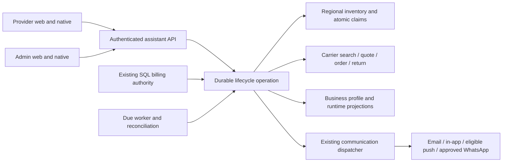

# AI Assistant — self-service numbers and forwarding changes

> **1 October 2026 — superseded in part.** The owner's final decisions are in `DECISIONS-2026-10-01.md` and the design to build is `FINAL-DESIGN.md` (its section 14 lists what changed). Read those first; **where this file differs, they win.** This file stays for the detail they do not repeat.

**MANDATORY CARRIER RESEARCH — COST IS SUPER IMPORTANT. The implementation session MUST research official Telnyx (Canada/US) and Plivo (India) billing online AGAIN: first and subsequent charges, proration/refunds, renewal calendar, month-end/leap dates, billing cutoff/timezone and available renewal APIs. Resolve conflicting information against the exact product/account and primary documentation, using authorized read-only evidence and written carrier confirmation when needed; ask the owner rather than guess. Read CARRIER-RESEARCH.md and RENEWAL-AUTOMATION.md fully. Save verified evidence and conservative UTC deadlines in the proposed partition-scoped Cosmos design after itemized schema approval; return eligible unused numbers with a default 24-hour lead. No unverified financial automation or promised refund.**

**Owner approved solution and mockup, 30 September 2026.** Read [final approved handoff](APPROVED-HANDOFF.md) first: any trial duration, historical regular billing even at zero dollars, national 10-digit entry, and existing admin queue integration. Itemized schema approval remains separate.

**Current revision:** [Renewal automation and owner-requested controls](RENEWAL-AUTOMATION.md) governs automatic returns, Keep, regional caps, country lock, configurable choices and protected approval history. Earlier manual-return/fixed-five review notes below are superseded where they conflict.

Design for owner review · 30 September 2026 · **Design approved; itemized schema gate applies**

This programme covers the telephone AI Assistant. It does not recreate the removed in-app chat assistant. No application code, schema, cloud resource, carrier account or template has been changed. Proposed names below are design contracts, not claims that those symbols exist.

## 0. Start here

For a short, plain-language explanation, read [Simple solution and flow](SIMPLE-OVERVIEW.md) first.

**Recommendation:** reuse the billing engine, introduce a durable number-lifecycle coordinator, use eligible owned numbers before buying, and apply separate configurable trial-only and paid-service quarantine policies. Separate AI entitlement, business number retention, and carrier rental. They have different clocks and must not share a single “expired” state.

Read in order:

1. [Verified implementation and findings](EVIDENCE.md).
2. [Carrier facts, cost model and remaining confirmations](CARRIER-RESEARCH.md).
3. This plan, including decisions below.
4. [Schema proposals and approval gate](SCHEMA-REVIEW.md).
5. [Delivery phases, acceptance tests and UI state contract](DELIVERY.md).
6. [Notification and WhatsApp specification](NOTIFICATIONS.md).
7. [Interactive mockup](../mockups/voice-number-lifecycle/index.html).
8. [Brand, responsive layout and native interaction contract](UX-SPEC.md).
9. [Edge cases, costs and configurable policy](EDGE-CASES.md).
10. [Delivery verification and remaining approvals](REVIEW-STATUS.md).

### Mockup register

| Sheet | Exact path | Approval date | Governs | Supersedes |
|---|---|---|---|---|
| voice-number-lifecycle | `C:\Nik\Data\mockups\voice-number-lifecycle\index.html` | Approved 2026-09-30 | Provider web/native number selection, forwarding request, expiry/recovery; admin web/native requests, business lookup and rental inventory; failure states | Approved: replaces only affected forwarding-change and number-provisioning controls in the existing voice sheets, not the voice picker or own-number test-call outcomes |
| voice-number-lifecycle (text amendments, no new sheet) | Same sheet | **PENDING the owner's acceptance — asked 2026-10-01** (`DECISIONS-2026-10-01.md` P2) | Four points only, listed in `FINAL-DESIGN.md` §12: the "own number · reconnect needed" forwarding state is not built; the trial timeline shows the exact removal time only once the service has ended; the inventory explains the buffer; the admin Voice Settings page gains three number inputs | Supersedes the drawn sheet on those four points only, once accepted. Everything else in the sheet still governs |
| voice-number-lifecycle (states built beyond the sheet, 2 October 2026) | Same sheet; the words are in `UI-CONTRACT.md` | **Not separately approved.** Provider screens were built under the owner's stated latitude (1 October: improve on the mockup for provider-facing screens without further approval); the admin additions follow the same sheet's patterns. Listed so the owner can review them | States the server can produce that the sheet does not draw. Provider: the removal card (which number, when, why, and whether a person did it); "your next number will come from our team" after an admin removal; "Our team replied" on a specific-number request; the sentence when the owner's confirmed phone is one we may not ring. Admin: the Close request dialog; the parked-number reason; the "can't be given to a business right now" quote state; the three limits in the settings history. **Added after the screen reviews (same day):** provider — "limit reached" as its own state with no button; "We're checking your request" while a confirm has no answer (the chosen number is locked); one "we couldn't load this" notice with Try again when the number status cannot be read in own-number mode; the open particular-number request shown under every view. Admin — a confirmation dialog (tick + red button) on **Release** for a cancelled business, which had been one click; the tick "I approve buying this number above the automatic limit" naming the price, on the app as on the web; "Nothing on this page" with Load more; "Parked" / "End the park" wording | Adds to the sheet on those states only; supersedes nothing |

All design documents live here; the mockup has its required single home under `Data\mockups`. The mockup uses fictional numbers and businesses and performs no real requests.

## 1. Decisions to approve

| ID | Strong recommendation | Why / alternative |
|---|---|---|
| D1 | Regional maximum monthly rental: Telnyx USD1; Plivo India INR200 pending account currency/product validation; setup zero | Owner requested configurable regional caps; see revision for strict price enforcement |
| D2 | Any-duration trial-only account: reminder at T−24h, AI entitlement ends at T, retain the number exclusively until T+24h, then detach; card/no-card does not determine quarantine classification | Gives a clear recovery day without another free day of AI. Historical regular AI billing and existing paid dunning remain separate |
| D3 | Trial-only quarantine default 0 days after the 24h hold; paid-service quarantine default 15 days after detach; separate appsettings | Owner-requested revision. Quarantine blocks reassignment only, never safe carrier return before renewal |
| D4 | Prefer eligible pool numbers; show up to the configured choice limit (default five), ranked by prepaid runway, then business locality, then verified-phone area, then same-country alternatives | Preserves the requested cost preference; details and the explicit geographic trade-off are in §5. No random cross-country assignment |
| D5 | Provider submits a forwarding change request; **only platform admin commits it**, after recording how control of the new number was checked | Read-only UI is insufficient. A request alone must never change routing or the account’s verified phone |
| D6 | Apply D5 to replacement of an existing connected own-number source too; retain self-service connection/test of the already authorized number | Closes the alternate change path without disabling the useful forwarding wizard |
| D7 | Automatic return before renewal, with admin Keep override and immediate failure alert | Owner requested automation; hourly sweep with at least 24h lead, conservative date-only boundary |
| D8 | Email + in-app lifecycle records; push where a device is registered; WhatsApp only for approved Utility service-status templates and eligible recipients | Avoid duplicate upgrade nags and avoid assuming Meta will classify a conversion invitation as Utility |
| D9 | Keep the current trial start event (billing activation), and show its actual end date throughout setup | Moving the start to successful number activation would affect grants, receipts, conversion and the other trial work. Decide that separately if provisioning delay should earn an extension |
| D10 | Keep native billing information-only. Native assistant setup and number selection work fully; payment action follows the existing web billing handoff | Preserves the current native payment contract while providing operational parity |
| D11 | Bootstrap the business forwarding target from the **current primary owner's server-confirmed phone**, then freeze it as a business setting; other destinations use the admin request | Existing SQL ownership follows Business.PrimaryOwnerMembershipId through active membership. Do not inherit whichever employee opens setup or silently change routing after ownership transfer |
| D12 | After effective paid service termination, use the same 24h number hold, with advance notice; existing dunning/grace completes first | Prevents paid cancellation from leaving an unbounded rented number while keeping paid-through service intact |

D1–D12 are approved design decisions as refined by APPROVED-HANDOFF.md and RENEWAL-AUTOMATION.md. Schema approval is separate and itemized in SCHEMA-REVIEW.md. Carrier facts marked unconfirmed must be resolved before the affected automatic spending/return feature is enabled.

## 2. What exists and what changes

Today, payment/trial enrollment opens setup; submission raises an admin alert; admin approves and assigns a number. Number assignment supports exact-number quotes, a monthly cost ceiling, carrier purchase, existing-number binding checks and runtime projection. Admins can remove, change, park or return a number, with history and notifications.

Trial conversion/downgrade already exists. Ending an AI add-on projects the minute allowance; it does **not** inventory, detach or return the carrier number. `Returned` and quarantine exist on an individual voiceline, but the current per-number partition key cannot produce a legal global pool query. A searchable inventory is genuinely new data, not an omitted UI over an existing pool table.

The work adds:

- An authorized forwarding request/review/apply flow.
- A recoverable self-service provisioning operation with configurable number selection and manual fallback.
- A regional inventory for claim ownership, paid-through/renewal evidence, safe reuse and admin return decisions.
- A number-retention workflow driven by the existing AI add-on’s effective billing outcome.
- Fencing and delivery recovery around existing multi-document transitions.

### Proposed architecture

The arrows represent recoverable workflow steps, not one cross-store transaction. External carrier success, runtime readiness and notification acceptance are tracked separately.

## 3. Forwarding number change

### Provider interaction

Beside **Number to reach you on**, display the saved routing number and “For your security, our team reviews number changes.” Add **Request a change**. The dialog contains the current number, read-only verified country/calling code and proposed number, a short explanation, and **Send request**. The dialog itself is the confirmation; do not add a redundant second “Are you sure?” modal.

Validate both client and server: normalize to E.164; apply country-aware length/type rules; reject extensions/shortcodes, the unchanged number, blocked/premium destinations, verification callers and every Clinket-owned number. The existing regex is only a syntax check. A +1 prefix does not distinguish Canada from the US; consult actual country/number metadata. Use the service country and routing policy, not a freely changed client country.

After sending, show **Request sent — your current number still works**. One unresolved request per business. Identical retries return the same request; a different number while pending requires withdrawing or replacing that request explicitly. Limit requests server-side with configured cooldown and daily limits; limits apply across devices and instances. An offline draft never reports “sent”.

### Authorization and source of truth

The authenticated business context selects the business; never use a supplied business ID or the acting member’s user number as the tenant. Require live `voice.number.manage` authorization for the provider request, consistent with the sensitive own-number operations. The platform Admin role owns approval and application. Business administrators are not platform administrators.

On first setup, obtain the initial permitted phone from a server-verified identity/business-authority path. **D11 recommends the current primary owner's confirmed phone.** Existing `BusinessMemberDirectory.GetPrimaryOwnerUserIdAsync` follows the live SQL owner membership; `UserProfile` inherits ASP.NET Identity's phone confirmation state. Reuse the canonical phone normalization/confirmation contract in the shared libraries, with no peer-host project reference. Re-check ownership and confirmation at commit; if missing, show contact verification or admin review. In a team, an employee opening the page must not replace business routing with their own phone. The current form's `formattedPhoneNumber` is not server proof.

Once established, the saved voice target is authoritative. Ordinary application saves must reject a changed target; profile contact edits must not silently overwrite it. They can still update other assistant settings. The request does not change sign-in, MFA, account recovery or identity phone verification.

### Admin interaction and audit

Create a dedicated **proposed** `VoiceForwardingChangeRequested` admin alert. Show it both on Alerts and in the AI Assistant Requests tab. Reuse business lookup to resolve the actual BusinessId. Display business, requester, current/requested number, number mode, received time, request status and verification evidence.

Admin may reject with a provider-facing reason or apply after verifying control. Recommended verification: admin-assisted challenge to the proposed number or documented verified callback, recorded in the operation. Do not mark the account phone verified as a side effect. No silent “admin can type any premium destination” escape hatch.

Application is conditional on the same request, expected old target and current business state. Concurrent changes produce a conflict/reload. Persist the decision, repairable routing work and notification intent before reporting completion. If runtime projection fails, display **Applying change**, retain a recovery job and do not send a success notice yet. Record actor, old/new numbers, decision time and evidence reference; mask numbers in logs.

For `NewDedicated`, update the saved target and runtime `ForwardTo`. For `ForwardExisting`, the field is the forwarding **source**: replace the authorized source, clear old forwarding proof/carrier-derived timing/answers-all authorization, and require the provider to disconnect old forwarding and connect/test the new source. Preserve the rule that `Voiceline.ForwardTo` is empty in this mode. Never promise automatic changes to the provider’s mobile carrier settings.

On confirmed completion send email, in-app and eligible push to the established business-security audience, including the requester where appropriate. Notify existing trusted contacts; the newly proposed phone must not become the sole recipient. New provider-facing copy must distinguish “number updated” from “connect your new number to finish”.

## 4. Self-service setup

### Owner-confirmed allocation switch — 30 September 2026

Automatic number allocation is controlled by a backend appsetting. This requirement is confirmed by the owner; it does not approve the remaining design or schema. The exact setting name must be chosen after checking the existing options binding and deployment conventions during implementation.

| Environment | Deployment default |
|---|---|
| Local and all lower environments | Off |
| Production | On |

**Off means today's admin-led allocation flow:** provider submits setup, admin receives the request, then admin selects/assigns an owned number or approves a purchase. Hide provider self-service number choices and prevent provider-triggered automatic claims or purchases on the server. Admin allocation still uses the planned safe ownership, cost and reconciliation rules; this is not permission to retain the current race conditions.

**On means the self-service flow below:** eligible pool first, then an affordable carrier number, with admin fallback when required. All cost, currency, entitlement and carrier-readiness checks still apply; enabling the switch cannot bypass them.

The switch controls **allocation only**. Both settings retain trial reminders, expiry handling, number holds, detachment, quarantine, inventory reconciliation, admin carrier returns and related notifications. Forwarding-change requests and admin approval also remain available. Turning allocation off does not disable or remove lifecycle workers, queues or resources.

Deployment automation must resolve the environment and explicitly write the value into the affected API and any allocation-executing worker configuration when creating **and updating** resources. Keep ARM parameters, `deploy.ps1`, appsettings and options defaults aligned. Base/local and class defaults are false; production receives an explicit true environment override. An intentional deployment override may disable production or enable a lower environment for testing. Do not infer environment from a hostname or silently reset an override during deployment.

Expose the effective capability through the existing client configuration approach for provider web/native; backend enforcement remains authoritative. Recheck it before accepting automatic allocation and before starting a queued carrier purchase. If switched off before an external purchase starts, release the internal reservation safely and route to admin. If a purchase may already have reached the carrier, finish reconciliation and safely complete or resolve that existing operation; never abandon a possibly rented number or buy another. Turning it on does not bulk-process earlier manual requests without an explicit retry/selection.

These environment defaults supersede the earlier suggestion that all number-lifecycle features should be disabled by default. The owner now requests automatic carrier returns with Keep overrides, independently of allocation; see the current revision.

1. Billing creates/activates the AI add-on through its current flow. Setup displays the real trial/paid state and expiry.
2. Validate current business membership, supported country, BusinessDetails + BusinessAddress readiness, required application fields, authorized phone and consent. Do not reintroduce seven-step onboarding as an AI gate.
3. Saving/submitting setup records a durable operation. Raise the existing submitted alert once per submission; it becomes an informational event on successful self-service completion, not an unresolved assignment job.
4. Query the regional pool. Exclude claimed/reserved/returning numbers, unexpired quarantine, uncertain ownership/compliance/pricing, system callers and wrong-country or wrong-carrier numbers. Revalidate selected inventory at commit.
5. If eligible numbers exist, show up to the configured choice limit (default five) in one list, with the recommended candidate selected and **Continue with this number** as the primary action. The provider may select another row before continuing. Only claim the selected number on confirmation; do not reserve five for one browsing user.
6. If no eligible pool number exists, search carrier inventory with the same ranking. Search is read-only. Display up to the configured choice limit (default five) affordable candidates; only the chosen number is purchased. If the user uses the recommended path, select the first eligible candidate under the same rules.
7. Re-check entitlement, price, capability, compliance and allocation claim immediately before any order. Persist `PurchaseStarted` and the exact candidate before making the external request. A lost response becomes **Confirming your number**; it never triggers a purchase of another number.
8. Confirm carrier ownership and routing application, then project the application and SQL minute ledger. Mark usable only once every required step is confirmed. A carrier order accepted/pending is not an active assistant.
9. Dedicated mode: **Your assistant is ready**. Existing-number mode: **Your assistant number is ready — connect your current number**, using the existing connect/test flow. Send the matching notification, update the admin outcome and refresh the demanded client state.
10. No affordable inventory, unsupported regulatory requirement, uncertain price/currency, carrier fault, exhausted spend budget or unresolved operation: preserve setup and open **Our team is finding your number** with an actionable admin reason. Never purchase over budget to hide a failure.

### Requests for a particular number

Provide **Need a particular number? Ask our team** in selection/settings. Allow a desired area or full E.164 plus short note. This creates an admin request only; no price promise, no purchase, no guarantee of availability. A premium/vanity purchase does not inherit permission to exceed the $1 rule. It needs a separately approved quote and payer arrangement. Porting a number the provider already owns is a separate workflow; do not label a vanity-number request as porting.

## 5. Geography and rental ranking

**Business address first as the geographic signal.** It reflects where customers expect the business to be. A personal mobile area code is portable and may describe an old city. Use carrier locality/rate-center metadata; do not maintain a guessed city-to-single-area-code table. City overlays mean more than one prefix can be correct. In India, mobile/national numbers must not be presented as a proven local city number merely from a prefix.

Recommended ranking is deterministic:

1. Hard eligibility: regional account/country, voice capability, compliance, ownership, no active claim/quarantine, no price/budget uncertainty.
2. Among pool numbers, first consider those whose confirmed paid-through boundary covers the planned trial + 24h retention. If any exist, hide shorter-runway alternatives from the initial configured choices.
3. Within that band: business locality/rate center → verified-phone area (same country) → other same-country numbers. Label the latter honestly.
4. Within the geographic band: latest next rental charge first, then stable E.164 tie-breaker. Return at most the configured limit (default five); fewer is fine.
5. If no number covers the horizon, show the best eligible alternatives only if the approved trial acquisition budget covers the renewal. Otherwise manual fallback. For paid signups, the horizon is the next paid entitlement boundary/approved operating budget rather than a trial fiction.
6. Only when the eligible pool is empty do we search new carrier inventory. Never buy a local number merely because an acceptable owned number is less local, unless the owner explicitly changes this cost-first policy.

For the example with ten renewals in one week and ten in three weeks: for a 14-day trial, the three-week group is offered first. Within that group, local matches lead. This deliberately allows a longer-prepaid nonlocal number to outrank a shorter-prepaid local number; D4 makes that trade-off explicit. If you prefer locality above cash runway, swap steps 2 and 3 and accept the possible earlier rental charge.

On Telnyx, ordinary numbers renew at the same calendar boundary, so “three weeks left versus one week left” generally does not differentiate two numbers on the same standard account. It matters on per-number Plivo renewals. Reassignment never resets a carrier billing anniversary.

## 6. Trial end and recovery

Use `ProviderAddOn`, not the regular plan tier, as the billing authority. A provider may remain on a paid plan while its AI add-on lapses, or vice versa.

| Time/state | Assistant and number behavior | Communication |
|---|---|---|
| T−24h | Existing trial continues, including existing minute limit | Trial-ending notice gives exact business-local end and number-removal deadline; card/no-card copy differs |
| T, no payment method / auto-renew off | Billing ends trial as today. AI allowance is removed. Number stays assigned during a 24h retention window | “Your trial has ended. Your number is held until [date/time].” Clear recovery action; own-number users also see disconnect instructions |
| T to T+24h | No extra AI entitlement. Dedicated mode may retain existing plain forwarding behavior; forwarded-source mode cannot ring the source back without looping | Never say “calls still reach you” in own-number mode. The recovery banner explains actual call behavior |
| Before detach, payment succeeds | Re-evaluate latest add-on and assignment; cancel pending removal, reproject allowance, preserve same number | Recovery confirmation, no extra rental purchase |
| T+24h, still lapsed | Fence assignment, block new calls/joins, drain bounded existing calls, clear business binding and published number, invalidate own-number proof | “Your assistant number has been removed.” No promise the same number will return |
| Number still carrier-owned | Apply trial-only 0-day or paid-service 15-day policy; enter quarantine only while its saved deadline is in the future. Safe carrier return is allowed throughout | Admin inventory shows quarantine and release deadline independently |
| Carrier-return deadline | Hourly UTC worker automatically returns eligible unused numbers unless Keep applies; re-check claim, billing and live-call state with per-number results | Confirm carrier removal; immediately alert on failure/unknown outcome, with admin remediation |

**Important distinctions:** paid renewal failure uses existing dunning (current defaults: seven-day grace and three attempts), not immediate T+24h trial removal. A pending bank payment is not nonpayment. Do not remove while settlement is genuinely pending; use existing reconciliation and escalation, with a separately configured maximum unresolved hold and human review. An exhausted minute allowance, user pause, private mode or admin hold is not a billing lapse and must never recycle the number.

The removal deadline remains T+24h even if a billing sweep or notification is late. Schedule advance notices and recover overdue detachment without extending the hold because a notice failed. Persist/retry/escalate notification failures and recover routing projections safely; record any outage-related rental exposure. A notice accepted for delivery is not proof of delivery.

Changing to 7/14-day trials uses existing configurable duration support. Do not overwrite the ongoing trial work or introduce a second eligibility ledger. The future implementation must re-read those files at its start.

## 7. Inventory and reliable execution

### Storage recommendation

Retain SQL billing, business profile state in ProviderData, and per-DID runtime voicelines in SystemData. Add a **regional operational inventory** to SystemData under an explicit fixed partition key per deployment/carrier account. This fits the existing operational Cosmos architecture and avoids illegal cross-partition scans. Exact proposed fields/families are in SCHEMA-REVIEW.md.

Use four narrowly scoped records in that partition: number asset, current business number slot, durable operation, and daily purchase-budget aggregate. Slot + number claim + operation + budget reservation can be one transactional batch. A business slot is one-to-one with a business, so it is one document, not a table of statuses. Historical operations are one-to-many and need separate bounded records. Existing `Voiceline` cannot replace this catalog: each number has a different partition and lacks rental facts. Existing monthly admin alerts cannot be the queue-of-record: alerts may be resolved or age out while work is unfinished.

No new container or SQL table is recommended. A single regional inventory partition is appropriate for the described hundreds of numbers, but its size/RU limits must be measured. Do not silently shard later; any partition redesign requires owner review.

### One writer per number and business

All admin and self-service allocation/removal paths use the coordinator. Conditional batch claims prevent two businesses acquiring one DID and prevent one business acquiring two DIDs. Claim generation travels through profile and voiceline projections. Every projector must refuse an older generation; an ETag retry must not reapply a stale owner to a new owner’s line.

A proposed operation progresses through validation → claimed → purchase requested/ownership confirmed → routing configured → runtime projected → completed. Manual review and unknown carrier outcome are explicit states. It holds an immutable request ID, exact number, actor, billing holder reference, price snapshot, generation, bounded retry schedule and named delivery intents. Timeouts release browsing reservations, but **never** release a claim whose purchase outcome is unknown.

Do not keep a SQL transaction or distributed lease across an external network call. Use bounded worker leases and a generation check before/after external actions. A worker lease expiring does not authorize a duplicate carrier order; reconciliation must decide the result of an already attempted purchase. No assumed carrier idempotency header.

Profile, inventory, billing and voiceline are not one distributed transaction. Durable operations repair the gaps. Success is the observed completed state, not “all calls probably ran”. A compare failure after a purchase keeps the number tracked for reconciliation; do not blindly release a number a concurrent operation may already own.

### Timers and messaging

Reuse the billing engine’s existing effective-outcome logic. Add a purpose-specific number lifecycle worker and reconciliation sweep, with all new trigger settings/queue provisioning in ARM and `deploy.ps1` in the implementation. Do not run carrier purchasing inside the provider HTTP request or overload the live voice-postcall pipeline.

Entitlement/detachment recovery cadence: a five-minute due sweep (separate from the hourly carrier-return scan), with scheduled wakeups for precise deadlines and the sweep as recovery. Due timestamps are durable and clocks are injectable; a scheduled message by itself is not the source of truth. The existing daily 04:00 UTC billing sweep cannot promise minute-accurate retention without this addition and an entitlement-boundary evaluation. Every candidate read is partition-scoped and paginated; bounded batches, continuation checkpoints and DLQ escalation prevent unbounded work.

For the SQL→Cosmos handoff, write/retry the lifecycle operation as a repairable tail of billing and reconcile tracked business slots against SQL. Never depend solely on “publish after SQL save”. Stale messages re-read the live add-on/slot and become no-ops after recovery. The worker may detach only after confirming the authoritative terminal entitlement state; unavailable SQL causes a defer/alert.

Store notification/admin-event delivery intents with the operation before sending. Deterministic event IDs deduplicate retries; acknowledgement is after queue acceptance. This provides durable at-least-once publication, not a claim of exactly-once third-party delivery. The recipient pipeline’s own dedup remains necessary after the broker dedup window.

### Release and active calls

Claim the asset as Returning before a carrier DELETE; allocation and return contend on the same record. Fencing blocks new sessions and joins, then existing sessions drain up to the existing bounded maximum call duration. Never reassign a DID while an earlier business’s call is live. Pre-deadline drain must include this allowance.

Unknown DELETE result → reconcile authoritative owned inventory before retrying. A number absent from a successful account lookup is released; a timeout/authorization error is not absence. Quarantine/park in Clinket does not cancel rental. Carrier disappearance outside this workflow causes an immediate incident, inert runtime and provider notification.

## 8. Money controls and admin experience

Separate monthly rental cap, one-time setup cap and total new-purchase budget. Enforce currency identity, valid non-negative decimal parsing with no rounding-down acceptance, voice capability, regulatory readiness and exact number match. Owned numbers have zero *new acquisition* cost, not zero monthly cost. Track their actual recurring price too; do not inherit an expensive admin purchase into the free trial pool.

Approved configurable controls (unspecified tuning values require validated implementation defaults): configurable choices (default five); short quote freshness window; one active provisioning operation/business; per-business request cooldown/day limit; per-account daily purchase count and spend limits; maximum carrier request concurrency; reservation lifetime; 24h retention; 24h automatic return lead plus conservative date-only margin; 24h escalation lead; maximum retry count/elapsed age. Regional rental caps, settings and proposed hourly return cadence are specified in RENEWAL-AUTOMATION.md; validate workload and retry limits before rollout.

Admin AI Assistant has three tabs: **Requests**, **Numbers**, **Activity**. Reuse the existing business lookup and show business identity separately from user identity. Forwarding/custom-number/manual-provisioning requests are actionable; successful self-service registrations go to Activity and Alerts without swelling the unresolved request count.

Numbers shows carrier/account, country/locality, status, current/last business, recurring fee/currency, confirmed next renewal, release-by deadline, quarantine end, last reconciliation and exact refusal reason. Filters: due within 48h, eligible to return, quarantined, available, assigned, unknown billing facts, failed operations. “Due tomorrow” uses the selected timezone and is a convenience filter; UTC instants drive execution. A date-only carrier renewal is displayed as date-only with a conservative deadline, never as an invented exact charge time.

Manual incident-remediation returns require preview + explicit confirmation, then a per-number result. A stale row that became assigned is skipped with its reason. Mixed currencies are never added as if they were one currency. Display **potential next-rental cost avoided**, not “refund”. Routine returns are automatic with an admin Keep override. Manual retry is incident remediation, not a required approval step; carrier outages can still cause renewal charges.

## 9. Costs the original example cannot avoid

**CARRIER BILLING AND COST ARE MANDATORY, not an optional later phase. Telnyx Canada/US standard recurring rental is first-of-month; initial-purchase proration and release credit need account confirmation. Plivo India Voice/Numbers rental starts at purchase; save and refresh the API's actual next renewal date, including month-end/leap changes. Full-month Plivo charges still apply to early removal. Do not use the first partial charge to pass the normal monthly rental cap. See CARRIER-RESEARCH.md for verified endpoints, sources and unresolved differences.**

**SAVE CARRIER BILLING EVIDENCE IN THE PROPOSED VoiceNumberAsset in SystemData, in the explicit deployment/carrier-account inventory partition; save purchase attempts/results in VoiceNumberOperation. Preserve raw dates and precision, distinguish carrier purchase from our observation, calculate the conservative UTC return deadline, and scan hourly at UTC minute 00 with a default 24-hour lead and overdue recovery. Every read/write/query is partition-scoped. Exact field/index changes require the separate itemized schema approval; this document does not authorize them.**

**The implementation session MUST research both carriers online AGAIN before coding financial behavior, resolve conflicts against the exact account/product and primary sources, and record the evidence. Unknown financial facts cannot become constants or guessed timestamps. Quarantined unused numbers remain returnable before renewal; do not renew them merely to finish quarantine.**

One hundred new $1 numbers cost up to $100 per rental cycle before setup, tax and usage. Recycling fifty does not refund the first $100. If the other fifty are safely returned before their next charge, the avoided next-cycle rental is $50 at that price. Trial-only numbers can be reused after the 24h hold and safety cleanup with default zero extra quarantine; paid-service numbers wait 15 days. Keep only inventory that can safely be reused before another charge or has an explicitly justified paid retention budget.

A Telnyx trial crossing the month boundary can incur another rental while still in trial. A $1 monthly ceiling does not imply $1 total trial acquisition cost. The approval decision must cover that difference; otherwise defer the purchase to admin. No “quality over speed” claim or UI can remove these carrier economics.

## 10. Completion and implementation gate

The owner approved D1–D12 as refined by the final handoff and approved the mockup. Do not request those approvals again. Exact schema items require separate explicit approval before schema work. Unknown carrier charge currency, release cutoff timezone, quote-to-order price guarantee and account-specific India compliance remain launch checks, not facts inferred from public pricing pages. This package intentionally makes no claim that every file in the whole platform was audited or that unrun integration tests passed.
